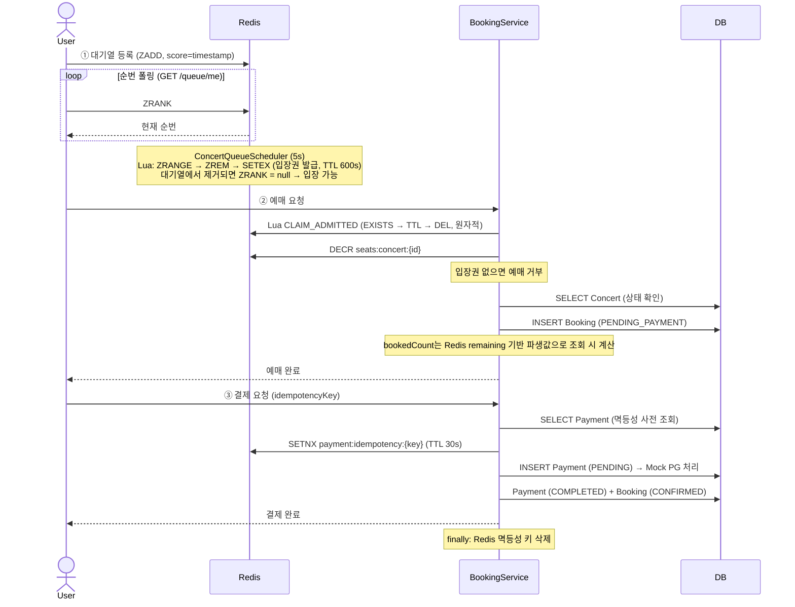
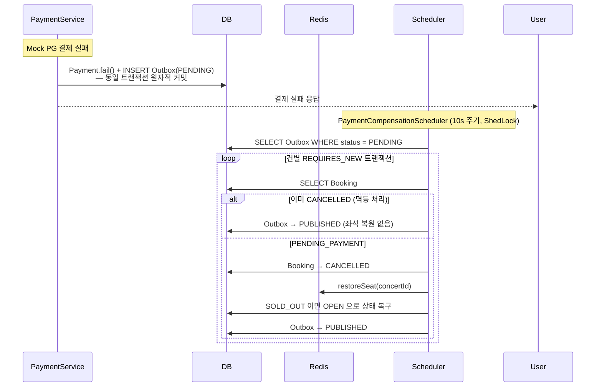
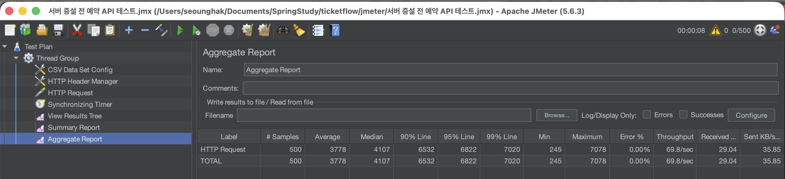
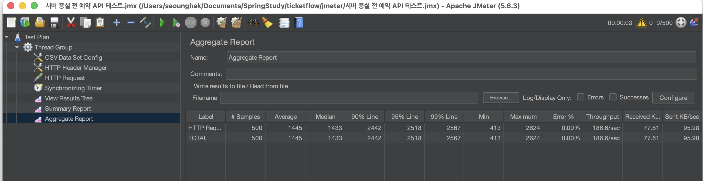
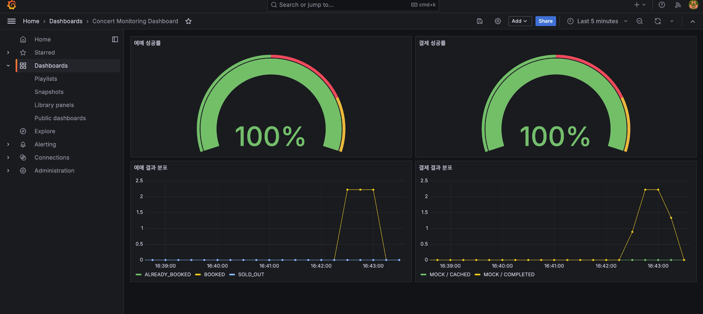
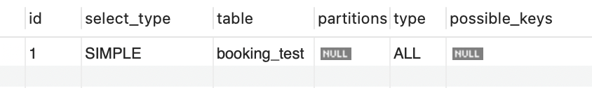
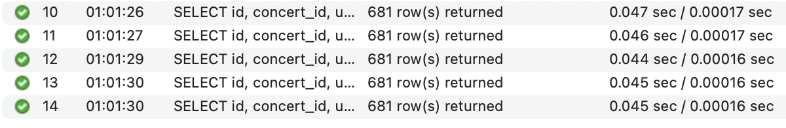
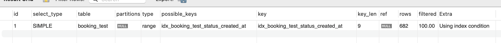
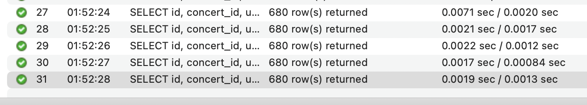

<div align="center">

# TicketFlow

**티켓팅 환경에서 발생하는 초과 예매·중복 결제·보상 누락·방치 예약 문제를 직접 재현하고 단계적으로 해결한 백엔드 프로젝트입니다.**

</div>

---

## 목차

- [프로젝트 소개](#프로젝트-소개)
- [기술 스택](#기술-스택)
- [해결한 문제](#해결한-문제)
- [예매 플로우](#예매-플로우)
- [핵심 기술 선택 이유](#핵심-기술-선택-이유)
- [성능 측정 결과](#성능-측정-결과)
- [트러블슈팅](#트러블슈팅)
- [DB 인덱스 최적화](#db-인덱스-최적화)
- [참조 문서](#참조-문서)

---

## 프로젝트 소개

티켓팅 서비스에서 "좌석이 1개 남았는데 2명이 예매됐다", "결제가 실패했는데 좌석이 돌아오지 않았다" 같은 문제는 왜 생기는 걸까. 이 프로젝트는 그 질문에서 출발했습니다.

처음에는 `SELECT ... FOR UPDATE`로 잔여석을 직렬화하면 충분하다고 봤습니다. 정합성은 지켜졌지만 500명 동시 요청에서 평균 응답 시간이 3.7초까지 올라갔습니다. Redis로 좌석 제어를 옮겼더니 이번엔 예상치 못한 위치에서 deadlock이 발생했습니다. "결제 실패 직후 즉시 보상"이 직관적이라고 생각했는데, 실패 주입 실험에서 보상 호출 자체도 같은 비율로 유실됐습니다.

매 단계마다 "이렇게 하면 될 것 같다"는 가설이 틀렸고, 부하 테스트와 실험 코드로 직접 확인한 뒤에야 다음 구조로 넘어갔습니다.

이 프로젝트에서 중점적으로 고민한 것은 세 가지입니다.

- **정합성 vs 처리량** — Lock 범위를 어디까지 잡아야 초과 예매를 막으면서도 응답 시간이 견딜 만한가
- **멱등성의 범위** — "중복 요청 차단"과 "동일 결과 반환"은 같은 문제가 아니다. 정상 재시도와 동시 중복 클릭은 서로 다른 방어선이 필요하다
- **보상의 완결성** — 결제 실패 사실을 DB에 기록하는 것과 보상 대상을 기록하는 것은 별개의 작업이다. 같은 트랜잭션에 묶이지 않으면 앱이 재시작할 때 보상 대상 정보가 사라진다

---

## 기술 스택

### Backend


### Data / Auth


-4B4B4B?style=for-the-badge&logoColor=white)


### Frontend


### Infra / Monitoring / Testing


---

## 해결한 문제

| 문제 | 원인 | 해결 방향 |
|---|---|---|
| **초과 예매** | 잔여석 확인과 INSERT 사이 타이밍 차이 | Redis DECR 원자 연산으로 좌석 점유 선결정 |
| **중복 결제** | 정상 재시도와 동시 중복 요청은 서로 다른 실패 지점을 가짐 | DB 사전 조회 + Redis SETNX + DB unique key 3계층 분리 |
| **보상 누락** | 결제 실패 후 보상 호출이 유실되면 좌석이 복구되지 않음 | Transactional Outbox로 보상 대상을 같은 트랜잭션에 기록 |
| **방치 예약** | 미결제 예약이 좌석을 장기 점유 | 30분 초과 `PENDING_PAYMENT` 자동 취소 + Redis 좌석 복원 |

각 문제를 `experiments/` 패키지에서 직접 재현하고, 로그와 부하 테스트 결과를 바탕으로 원인을 좁혀가며 구조를 바꿨습니다.

---

## 예매 플로우

### 시스템 아키텍처

MVP에서는 DB row lock으로 좌석을 제어했으나, 부하 테스트에서 hot row 병목을 확인한 뒤 "실시간 제어는 Redis, 영속 상태 저장은 DB"로 역할을 분리했습니다.


### 예매 플로우



### 결제 실패 보상 플로우

보상을 "결제 실패 직후 즉시 호출"로 먼저 구현했지만, 실패 주입 실험에서 보상 호출 자체도 같은 비율로 유실됐습니다.
현재는 보상 사실을 Outbox에 남기고, 스케줄러가 좌석 복구와 상태 전환을 책임집니다.



---

## 핵심 기술 선택 이유

<details>
<summary><strong>Redis Sorted Set + Lua Script — 대기열을 왜 Redis로 옮겼고, 왜 Lua가 필요했나</strong></summary>

### 처음에는 이렇게 생각했습니다

DB 테이블 하나로 대기열을 구현해도 충분하다고 봤습니다. `INSERT INTO queue (user_id, created_at)` 후 `COUNT(*)` 로 순번을 계산하면 단순하고 이해하기 쉽습니다.

### 문제를 확인했습니다

티켓팅 오픈 순간에는 등록보다 조회가 훨씬 많습니다. 수백 명이 짧은 주기로 순번을 폴링하면 `COUNT(*)` 쿼리가 반복되고, 대기열 읽기 비용이 그대로 DB에 쌓였습니다.

### 대안을 비교했습니다

**DB 테이블**: 구현이 단순하지만, 순번 조회 쿼리가 폴링마다 반복돼 고동시성에서 DB 부하가 집중됩니다.

**Redis List**: LPUSH/LINDEX로 순번 조회는 가능하지만, 중간 삭제(입장 처리 시 LREM)가 O(N)입니다. 대기열 규모가 커질수록 입장 처리 비용이 선형으로 늘어납니다.

**Redis Sorted Set**: ZADD O(log N), ZRANK O(log N)으로 순번 조회, ZREM O(log N)으로 삭제. score를 등록 타임스탬프로 설정하면 선착순 순서가 자동으로 유지되고, 모든 주요 연산이 O(log N)입니다.

Sorted Set도 단점이 있습니다. List보다 메모리를 더 씁니다. 수백만 명 규모라면 skip list 오버헤드가 무시할 수 없습니다. 그러나 티켓팅 대기열은 이벤트 오픈 직후 수백~수천 명 수준이고, 입장 처리 후 빠르게 줄어드는 특성이 있습니다. 이 규모에서는 조회 성능 이점이 메모리 트레이드오프를 상쇄합니다.

### Sorted Set만으로는 부족했습니다

Sorted Set을 선택한 뒤 새 문제가 생겼습니다. 입장권 발급이 `ZRANGE → ZREM → SETEX` 세 단계인데, 이 사이에 스케줄러가 두 번 실행되거나 프로세스가 죽으면 어떻게 될까요.

- ZREM은 됐는데 SETEX 전에 프로세스가 죽으면 → 대기열에서 빠졌지만 입장권이 없는 사용자 발생
- 스케줄러가 거의 동시에 두 번 실행되면 → 같은 사용자에게 입장권 중복 발급

원자성을 보장하는 방법을 세 가지 비교했습니다.

**Java 순차 호출**: 구현이 가장 단순하지만, 세 명령 사이에 다른 요청이 끼어들 수 있습니다. 원자성이 없습니다.

**Redis MULTI/EXEC with WATCH**: WATCH로 감시하던 키가 변경되면 EXEC가 무효화되고 재시도가 필요합니다. 동시 요청이 많은 구간에서 WATCH 실패가 자주 발생하면 재시도 루프가 필요해지고, "단순한 원자 연산"이 "재시도를 제어하는 복잡한 코드"가 됩니다.

**Lua Script**: Redis 서버 내부에서 단일 스레드로 실행되어 재시도 없이 원자성이 보장됩니다. 스크립트 오류 시 디버깅이 어렵고, 복잡한 스크립트는 서버 응답을 블로킹할 수 있습니다. 그러나 세 줄짜리 연산이라면 이 트레이드오프가 납득됩니다.

```lua
-- POP_AND_GRANT: 대기열 상위 N명을 꺼내 입장권 발급 (원자적)
local users = redis.call('ZRANGE', queueKey, 0, count - 1)
if (#users == 0) then return users end
redis.call('ZREM', queueKey, unpack(users))
for i = 1, #users do
  redis.call('SETEX', admittedPrefix .. users[i], ttl, '1')
end
return users
```

입장권 소비(`EXISTS → TTL → DEL`)도 같은 이유로 Lua Script를 사용합니다. 반환값으로 남은 TTL을 받아, DB 처리 실패 시 입장권을 원래 잔여 TTL로 복원하는 데도 활용했습니다.

```lua
-- CLAIM_ADMITTED: 입장권 확인 + 원자적 소비, 남은 TTL 반환
if redis.call('EXISTS', key) == 0 then return -1 end
local ttl = redis.call('TTL', key)
redis.call('DEL', key)
return ttl
```

### 결과

대기열 순번 조회가 DB polling이 아닌 Redis ZRANK 단일 명령으로 처리됩니다. 입장권 발급과 소비는 Lua Script로 원자성을 보장해 중복 발급과 TOCTOU 문제를 방지했습니다.

</details>

<details>
<summary><strong>DB Lock — 낙관적 락과 비관적 락 중 어느 쪽이 티켓팅에 맞는가</strong></summary>

### 처음에는 이렇게 생각했습니다

Optimistic Lock과 Pessimistic Lock 중 하나를 고르면 해결될 거라고 생각했습니다. 충돌이 많으면 비관적 락, 드물면 낙관적 락이라는 통념에서 시작했고, "낙관적 락이 처리량이 높다"는 설명을 보고 처음엔 낙관적 락을 먼저 고려했습니다.

### 낙관적 락의 트레이드오프를 확인했습니다

낙관적 락은 충돌이 드문 환경에서 비관적 락보다 처리량이 높습니다. DB 자원을 커밋 시점에만 잡기 때문입니다. 그러나 이 이점은 "충돌이 드문 환경"이라는 전제에서만 성립합니다.

티켓팅 오픈 직후는 "거의 모든 요청이 같은 좌석 row를 읽고 UPDATE하는 구간"입니다. 충돌은 예외가 아니라 정상 상태입니다.

```
[낙관적 락 시나리오]
50개 스레드 동시 요청 → 1개만 커밋 성공 → 49개 OptimisticLockException
→ 재시도 → 또 충돌 → 재시도 무한 반복
→ 응답 지연 누적, DB 커넥션 점유 증가
```

재시도 횟수를 제한해도, 실패한 요청들이 에러로 끝나는 건 동일합니다. 낙관적 락의 장점은 이 구간에서 발현되지 않습니다.

### 비관적 락의 트레이드오프를 비교했습니다

비관적 락은 락을 잡은 트랜잭션이 완료할 때까지 다른 트랜잭션이 대기합니다. 재시도 없이 순차 처리됩니다. 크리티컬 섹션이 길면 대기 시간이 누적되는 문제가 있습니다.

그러나 잔여석 차감은 단순 UPDATE 연산입니다. 락 유지 시간이 짧아 대기 비용이 크지 않습니다. 더해서, Redis 대기열이 이미 진입 인원을 50명 단위로 나눠 입장시키기 때문에 실제 동시에 좌석을 차감하는 인원도 제한됩니다. 락 경합 자체가 크지 않다는 점도 비관적 락을 선택하는 데 유리하게 작용했습니다.

### 결과

초과 예매를 막았습니다. 부하 테스트에서 "정합성은 확보됐지만 고동시성 처리량은 부족한 구조"라는 다음 문제를 확인했고, 이후 Redis 좌석 차감으로 개선했습니다.

</details>

<details>
<summary><strong>Redis 좌석 차감 + 파생 bookedCount — deadlock 원인이 예상 밖에 있었다</strong></summary>

### 처음에는 이렇게 생각했습니다

DB 락 구조에서 벗어나면 응답 시간이 좋아질 것 같아, 좌석 제어를 Redis `decrementSeat`로 옮겼습니다. 이때도 예약 성공 수를 바로 확인하고 싶어서 `concert.booked_count = booked_count + 1` 업데이트는 유지했습니다.

### 예상치 못한 위치에서 deadlock이 발생했습니다

JMeter 동시 예약 테스트에서 일부 요청이 500으로 실패했고, 로그에 아래 예외가 남았습니다.

```text
MySQLTransactionRollbackException: Deadlock found when trying to get lock; try restarting transaction
```

Redis로 좌석 제어를 옮겼는데 왜 DB deadlock이 생길까요. `BookingService.book()` 흐름을 따라가봤습니다. `booking INSERT` 직후 `incrementBookedCount()`를 호출해 `concert.booked_count`를 즉시 UPDATE하고 있었습니다. 좌석 점유는 Redis가 처리했지만, 모든 성공 요청이 여전히 같은 `concert` 행을 UPDATE하고 있었습니다. `booking INSERT`가 잡는 인덱스/외래키 락과 `concert` UPDATE 락이 같은 트랜잭션 안에서 섞이면서 deadlock이 발생했습니다.

### deadlock 제거를 위한 선택지를 비교했습니다

**방법 1: concert UPDATE를 별도 트랜잭션으로 분리**
`@Transactional(REQUIRES_NEW)`로 booked_count만 따로 UPDATE하면 두 락이 같은 트랜잭션에서 충돌하지 않습니다. deadlock은 해소되지만 모든 요청이 같은 concert 행을 UPDATE하는 hot row 문제는 그대로 남습니다. 응답 시간 병목이 형태만 바뀝니다.

**방법 2: booked_count를 비동기로 갱신**
`@Async`나 이벤트로 booked_count 갱신을 뒤로 미루면 동기 병목을 줄일 수 있습니다. 하지만 갱신이 지연되는 구간에 조회하면 stale한 값이 반환됩니다. 정합성보다 조회 성능을 우선하는 설계입니다.

**방법 3: bookedCount를 파생값으로 전환**
booked_count UPDATE를 완전히 제거하고, 조회 시 `totalSeats - Redis remainingSeats`로 계산합니다. 즉시 갱신할 필요가 없어 hot row 자체가 사라집니다.

단점이 있습니다. Redis가 내려가면 실시간 잔여석 값을 구할 수 없습니다. 이 경우 fallback으로 DB에 저장된 마지막 `bookedCount`를 사용하고 경고 로그를 남기는 방식으로 완화했습니다. Redis를 실시간 제어 도구로 쓰는 이상 Redis 가용성에 대한 의존이 생기는 건 피할 수 없고, fallback을 명시적으로 설계하는 것이 더 나은 접근이라고 판단했습니다.

방법 1은 hot row를 남겨두고, 방법 2는 stale 조회를 허용합니다. 방법 3을 선택했습니다.

### 결과

concert 행을 매 요청마다 갱신하던 hot row update가 사라졌고, 동일 시나리오에서 deadlock 없이 병렬 처리가 가능해졌습니다.

</details>

<details>
<summary><strong>3계층 멱등성 — "unique key 하나면 되지 않나"에서 시작한 고민</strong></summary>

### 처음에는 이렇게 생각했습니다

DB에 `uk_payment_idempotency_key` unique constraint 하나를 두면 충분하다고 생각했습니다. 중복 요청이 들어오면 INSERT가 실패하고 호출자가 이미 처리됐다는 걸 알 수 있으니까요.

`experiments/e3`에서 세 전략을 각각 실험하면서 이 생각이 틀렸다는 걸 확인했습니다.

### 세 전략이 서로 다른 상황에서 무너졌습니다

**전략 A — DB unique key만 사용**

중복 요청이 거의 동시에 들어오면 두 요청 모두 비즈니스 로직 초반을 통과합니다. INSERT 시점에야 충돌이 드러나는데, 그 전에 이미 결제 관련 로직이 실행된 상태입니다. 충돌을 앞단에서 차단하지 못합니다.

두 번째 문제가 있습니다. 이미 성공한 결제를 사용자가 재시도하는 경우, unique constraint 예외로 처리하면 클라이언트 입장에서는 "결제 실패"처럼 보입니다. 멱등성의 본래 의미는 "같은 요청이 들어왔을 때 기존 결과를 그대로 반환하는 것"인데, unique key만으로는 그 반환 처리를 할 수 없습니다.

**전략 B — SELECT EXISTS → INSERT**

이미 처리된 재시도는 빠르게 걸러낼 수 있고, 기존 결과를 반환하기도 쉽습니다. 그러나 SELECT와 INSERT 사이에 동시 요청이 끼어들면 둘 다 SELECT에서 "없음"을 보고 INSERT로 진입합니다. 동시 중복 클릭에 취약합니다.

**전략 C — Redis SETNX만 사용**

동시 요청 차단에는 효과적입니다. 그러나 Redis가 장애 상태면 방어선이 통째로 사라집니다.

### 세 계층이 서로 다른 실패 시나리오를 담당하도록 조합했습니다

실험을 통해 각 전략이 담당할 수 있는 상황이 다르다는 것을 확인했습니다. 세 계층을 조합하면 각각의 취약점을 서로 보완합니다.

| 계층 | 역할 | 대응 상황 |
|---|---|---|
| DB 사전 조회 | 이미 처리된 요청이면 기존 결과 즉시 반환 | 정상 재시도 |
| Redis SETNX (TTL 30s) | 동일 키의 동시 요청을 앞단에서 차단 | 동시 중복 클릭 |
| DB unique key | Redis 장애 시 최후 방어선 | Redis 장애 |

3계층은 구현 복잡도를 높입니다. 계층이 많을수록 버그가 숨을 자리도 많아집니다. 그러나 각 계층이 서로 다른 실패 모드를 담당하고, 하나가 동작하지 않아도 나머지가 보완하는 구조이기 때문에 결제라는 도메인에서는 이 복잡도가 납득됩니다.

### 결과

`PaymentServiceFailRateTest` — 동일 idempotencyKey로 재요청 시 기존 결과가 반환됨을 검증합니다. Grafana 대시보드에서 `MOCK/CACHED` 분포로 중복 결제가 실제로 차단되고 동일 결과가 반환됐음을 확인했습니다.

</details>

<details>
<summary><strong>Transactional Outbox — Kafka가 아닌 Outbox를 선택한 이유</strong></summary>

### 처음에는 이렇게 생각했습니다

결제 실패 시 즉시 보상 로직을 호출하는 방식(Fire-and-forget)으로 먼저 구현했습니다. `paymentService.fail()` 이후 바로 `bookingService.cancel()`을 호출하면 됩니다. 직관적이고 단순합니다.

### 실패 주입 실험에서 문제를 확인했습니다

`experiments/e4`에서 N번째 호출마다 예외를 주입하는 방식으로 실패율을 시뮬레이션했습니다. 일정 비율의 결제 실패를 주입하자, 보상 호출 자체도 같은 비율로 실패했습니다. 결제는 실패했는데 좌석 복원은 안 된 케이스가 발생했습니다.

근본 원인은 "결제 실패"와 "보상 대상 기록"이 별개의 작업이라는 점이었습니다. 결제 실패는 DB에 남는데, 보상 대상은 메모리와 비동기 호출 흐름 안에만 있습니다. 앱이 재시작되면 보상 대상 정보가 사라집니다.

### 대안을 비교했습니다

**Fire-and-forget**: 단순하지만 보상 대상이 메모리에만 존재합니다. 앱 재시작, 네트워크 순단, 예외 발생 — 보상 호출이 끊길 수 있는 지점이 너무 많습니다.

**@Async + 재시도**: Fire-and-forget보다는 낫지만 재시작 시 대기 중인 작업이 사라지는 건 동일합니다. 영속성이 없습니다.

**Kafka / 메시지 브로커**: 발행-구독 구조로 보상 처리를 완전히 분리할 수 있고, 재처리·순서 보장·확장성 면에서 가장 강력한 선택지입니다. 그러나 Kafka 클러스터 운영, 토픽 관리, Consumer 설계가 추가됩니다. 지금 해결하려는 문제는 "결제 실패 후 보상이 유실되지 않게"입니다. 이 범위에서는 인프라 복잡도가 너무 높습니다.

**Transactional Outbox**: "결제 실패"와 "보상해야 한다는 사실"을 같은 트랜잭션에 저장합니다. 결제 실패가 DB에 남아있으면 보상 대상 Outbox도 반드시 남아있습니다. 단점은 DB 폴링 오버헤드(10초마다)가 생기고, 보상이 즉시가 아닌 최대 10초 지연된다는 점입니다. 그러나 이 지연이 허용되는 범위이고, 나중에 Kafka로 전환하더라도 Outbox 테이블 구조를 그대로 유지할 수 있습니다.

```
Fire-and-forget:
  결제 실패 (DB에 기록) → 보상 호출 → 앱 종료 → 이벤트 유실
  재시작 후: 결제 실패 기록은 있지만, 보상해야 한다는 정보가 없음

Outbox 패턴:
  [같은 트랜잭션] Payment.fail() + INSERT Outbox(PENDING)
  앱 재시작 후에도 Outbox가 남아 Scheduler가 재처리
```

### 결과

동일한 실패율을 주입했을 때, Outbox 방식은 스케줄러 재처리를 통해 최종 100% 보상 성공을 확인했습니다. 각 Outbox는 `REQUIRES_NEW` 트랜잭션으로 독립 처리되며, 최대 3회 재시도 후 `FAILED`로 전환되어 Grafana 알림을 발송합니다.

</details>

---

## 성능 측정 결과

### 서버를 늘려야 할까?

처음에는 서버를 더 띄우면 해결될 수 있다고 생각했습니다. 하지만 증설 전에 먼저 확인하고 싶었던 건 "정말 서버 대수가 문제인가, 아니면 현재 동시성 제어 구조가 먼저 병목인가?"였습니다.

그래서 예매 부하 테스트를 단계별로 진행했습니다.

- 개선 전에는 DB row lock 기반 구조에서 응답 시간이 어떻게 변하는지 확인했습니다.
- Redis 좌석 차감으로 1차 개선한 뒤에는 deadlock 로그가 실제로 발생하는지 확인했습니다.
- 마지막으로 `bookedCount` 동기 UPDATE를 제거한 뒤 같은 조건에서 다시 측정했습니다.

결론적으로 병목은 서버 수보다 **DB row lock + hot row update** 에 더 가까웠습니다. 그래서 증설보다 구조 변경을 먼저 선택했습니다.

<details>
<summary><strong>부하 테스트 상세 보기</strong></summary>

### 1. 개선 전: DB Lock 기반 구조

처음 구조에서는 초과 예매를 막는 데 집중했습니다. 실제로 정합성은 잘 지켜졌지만, 좌석 수와 동시 요청 수가 늘수록 직렬화 비용이 빠르게 커졌습니다.

| 시나리오 | 평균 응답 시간 | p95 | 처리량 | 결과 해석 |
|---|---:|---:|---:|---|
| 100석 / 100명 | 162ms | 257ms | 334.4/sec | 낮은 지연 시간으로 안정 처리 |
| 100석 / 300명 | 1310ms | 1609ms | 133.9/sec | 실패율 66.67%, 좌석 초과 요청은 정상적으로 마감 처리 |
| 300석 / 300명 | 1146ms | 1941ms | 143.8/sec | 전부 성공, 다만 응답 지연이 커짐 |
| 500석 / 500명 | 3778ms | 6822ms | 69.8/sec | 전부 성공, 정합성은 유지됐지만 직렬 처리 한계 확인 |

### 2. 커넥션 풀 증가 실험 (Hikari pool 10 → 50) — 더 느려졌다

DB Lock 구조에서 응답 시간이 길어지는 걸 보고, 처음 든 생각은 "커넥션 풀이 부족해서 요청이 대기하는 건 아닐까?"였습니다. Hikari pool 사이즈를 10에서 50으로 늘리면 더 많은 요청이 동시에 처리될 것이라고 예상했습니다.

결과는 예상과 반대였습니다.

| 지표 | pool=10 | pool=50 |
|---|---:|---:|
| 평균 응답 시간 | 3778ms | 5656ms |
| p95 | 6822ms | 9650ms |
| TPS | 69.8/sec | 49.8/sec |
| 에러율 | 0% | 0% |

커넥션 풀을 5배 늘렸더니 응답 시간이 약 50% 더 늘어났습니다.

**왜 더 나빠졌는지 InnoDB lock 통계로 확인했습니다.**

테스트 전후로 MySQL InnoDB row lock 누적 지표를 수집했습니다.

| 지표 | pool=10 이후 | pool=50 이후 | 증가량 |
|---|---:|---:|---:|
| `Innodb_row_lock_waits` | 5,586 | 6,085 | +499 |
| `Innodb_row_lock_time` (ms) | 201,222 | 594,108 | +392,886ms |
| 평균 락 대기 시간 | — | — | 392,886 / 499 ≈ **787ms** |

pool=50 조건에서 row lock 한 번 대기에 평균 787ms가 소요됐습니다.

**원인 해석**: 커넥션 풀을 늘리면 더 많은 트랜잭션이 동시에 DB에 진입할 수 있습니다. 그런데 이 구조에서는 모든 성공 요청이 같은 `concert` 행의 Pessimistic Lock을 잡으려 합니다. 동시에 진입하는 트랜잭션이 많아질수록 같은 row를 두고 경합하는 수가 늘어나고, lock 대기 줄이 길어집니다. 커넥션 풀 부족이 병목이 아니었습니다. 더 많은 요청을 동시에 DB로 밀어 넣을수록 lock 경합이 심해지는 구조가 문제였습니다.

이 실험을 통해 "서버 자원 증설보다 구조 변경이 먼저"라는 판단의 근거를 직접 확인할 수 있었습니다.

### 3. 1차 개선 후: Redis 좌석 차감 도입

좌석 제어를 Redis `decrementSeat`로 옮기면 병렬성이 좋아질 거라고 판단했습니다. 실제로 DB row lock 병목은 줄었지만, 예약 성공 직후 `concert.booked_count`를 즉시 UPDATE하던 로직이 새로운 문제를 만들었습니다.

```text
MySQLTransactionRollbackException: Deadlock found when trying to get lock; try restarting transaction
```

`booking INSERT` 이후 같은 트랜잭션 안에서 `concert.booked_count`를 갱신하면서 동일 공연 행이 hot row가 됐고, 일부 요청이 500으로 실패했습니다.

### 4. 최종 개선: bookedCount 파생값 전환

- 좌석 정합성: Redis `decrementSeat` / `restoreSeat`
- DB 역할: `booking INSERT`, 상태 저장, 보상 이력 저장
- `bookedCount`: `totalSeats - remainingSeat`로 조회 시 계산

이후 같은 500석 / 500명 시나리오를 다시 측정했습니다.

| 시나리오 | 평균 응답 시간 | p95 | 처리량 | 에러율 |
|---|---:|---:|---:|---:|
| 500석 / 500명 | 1445ms | 2518ms | 186.6/sec | 0% |

### 5. 개선 전 vs 개선 후

| 지표 | 개선 전 | 개선 후 | 개선율 |
|---|---:|---:|---|
| Avg 응답 시간 | 3778ms | 1445ms | 약 62% 감소 |
| p95 | 6822ms | 2518ms | 약 63% 감소 |
| TPS | 69.8/sec | 186.6/sec | 약 167% 증가 |
| Error | 일부 500 + deadlock | 0% | 안정성 확보 |

### 6. 이미지로 본 변화

#### 개선 전 JMeter 결과



개선 전에는 좌석 정합성은 유지됐지만, 요청이 몰릴수록 DB row lock 대기로 응답 시간이 급격히 증가했습니다.

#### 개선 후 JMeter 결과



`bookedCount`를 파생값으로 전환한 뒤에는 deadlock 없이 동일 시나리오를 처리했고, 평균 응답 시간과 처리량이 함께 개선됐습니다.

#### Grafana 대시보드



예약 결과 분포와 보상 처리 상태를 통해, 단순히 빨라졌는지만 본 것이 아니라 실패 유형과 정합성까지 함께 확인했습니다.

| 분포 항목 | 의미 |
|---|---|
| `BOOKED` | 예매 성공 |
| `ALREADY_BOOKED` | 중복 예매 시도 → 차단됨 |
| `SOLD_OUT` | 잔여석 없음 |
| `MOCK/COMPLETED` | 결제 성공 |
| `MOCK/CACHED` | 멱등성 키로 재반환 (중복 결제 차단) |

</details>

---

## 트러블슈팅

<details>
<summary><strong>입장권 소비 중 TTL 만료 타이밍 충돌 — EXISTS와 DEL 사이의 틈</strong></summary>

### 문제 상황

초기 구현에서 입장권 소비를 `EXISTS` 확인 후 `DEL`로 처리했습니다. 이 방식에서 입장권이 없는 사용자가 예매를 통과하는 케이스가 발생했습니다.

### 원인 탐색

`EXISTS`와 `DEL`은 별개의 Redis 명령입니다. Java에서 순차 호출하면 두 명령 사이에 시간 간격이 있습니다.

```
EXISTS → true
  ... 이 사이에 TTL 만료 ...
DEL → "성공" (없는 키를 DEL해도 Redis는 에러를 반환하지 않음)
→ 예매 진행  ← 입장권이 없는 상태에서 통과
```

`DEL`의 반환값이 0(삭제할 키 없음)이어도 코드에서 이를 확인하지 않았습니다.

### 선택지를 비교했습니다

**방법 1: DEL 반환값 확인**
DEL이 0을 반환하면 이미 만료된 것으로 처리합니다. EXISTS + DEL 두 명령이 따로 실행되는 건 동일해서 EXISTS와 DEL 사이에 만료가 발생하면 EXISTS는 true를 반환했지만 DEL 결과는 0이 됩니다. 이 경우는 잡을 수 있습니다. 하지만 DEL 이후 만료가 발생하는 경우는 잡지 못합니다. 그리고 근본적으로 두 명령 사이의 타이밍 의존성이 남습니다.

**방법 2: SET NX EX 뮤텍스 방식**
아예 입장권 소비를 별도 키 점유 방식으로 교체할 수 있습니다. 구조가 달라져 기존 TTL을 복원하는 로직을 만들기 어렵고, 설계 복잡도가 올라갑니다.

**방법 3: Lua Script**
EXISTS → TTL → DEL을 Redis 서버에서 원자적으로 실행합니다. 세 명령이 끊기지 않고 단위 실행되기 때문에 TOCTOU가 발생하지 않습니다. 추가로 TTL 반환값을 활용해 DB 처리 실패 시 입장권을 원래 잔여 TTL로 복원하는 기능도 얻었습니다.

Lua Script의 단점(디버깅 난이도)은 있지만, 세 줄짜리 스크립트이고 동작이 명확합니다. 방법 1은 타이밍 의존성을 완전히 제거하지 못하고, 방법 2는 기존 구조를 너무 크게 바꿉니다.

```lua
-- CLAIM_ADMITTED: EXISTS → TTL → DEL 원자적 처리, 없으면 -1 반환
if redis.call('EXISTS', key) == 0 then return -1 end
local ttl = redis.call('TTL', key)
redis.call('DEL', key)
return ttl
```

### 결과

입장권이 없거나 만료된 상태에서 예매 시도가 정확히 차단됩니다. DB 처리 실패 시 반환받은 TTL로 입장권을 복원해 재시도를 허용할 수 있게 됐습니다.

</details>

<details>
<summary><strong>Outbox 상태가 처리 후에도 PENDING으로 남았다 — detached 엔티티 함정</strong></summary>

### 문제 상황

보상 처리 로직이 실행됐는데도 `PaymentCompensationOutbox` 상태가 `PUBLISHED`나 `FAILED`로 바뀌지 않았습니다. 같은 Outbox가 스케줄러에 의해 반복 조회되어 보상 처리가 중복 시도됐습니다.

### 원인 탐색

로그에는 `outbox.markPublished()` 호출이 분명히 찍혔습니다. 예외도 없었습니다. 그런데 DB를 직접 조회해보면 상태가 그대로입니다.

JPA dirty checking이 동작하려면 엔티티가 현재 영속성 컨텍스트에서 관리되는 **managed 상태**여야 합니다. 스케줄러 메서드에는 `@Transactional`이 없었습니다. `findByStatus()`를 호출하면 Spring Data JPA가 내부적으로 짧은 트랜잭션을 열고 바로 닫습니다. **이 순간 반환된 엔티티는 detached 상태가 됩니다.**

이 detached 엔티티를 `REQUIRES_NEW` 트랜잭션을 가진 Processor로 그대로 넘기면, 새 영속성 컨텍스트는 이 엔티티를 관리하지 않습니다. 아무리 `markPublished()`를 호출해도 자바 객체의 필드값만 바뀔 뿐, DB UPDATE는 발생하지 않습니다.

### 선택지를 비교했습니다

**방법 1: entityManager.merge(outbox)**
detached 엔티티를 영속성 컨텍스트에 재등록합니다. 동작하지만, merge는 전달된 엔티티의 현재 상태를 DB에 그대로 반영합니다. 엔티티가 조회된 시점 이후로 다른 트랜잭션에서 상태가 바뀐 게 있다면 stale 데이터로 덮어쓸 위험이 있습니다.

**방법 2: 스케줄러에 @Transactional 추가**
전체 Outbox 처리를 하나의 트랜잭션으로 묶으면 엔티티가 managed 상태를 유지합니다. 그러나 Outbox A 처리 중 예외가 발생하면 Outbox B까지 함께 롤백됩니다. Outbox별 독립 처리라는 패턴의 의미가 사라집니다.

**방법 3: ID만 전달하고 Processor 안에서 재조회**
`REQUIRES_NEW` 트랜잭션 내부에서 엔티티를 새로 조회하면 항상 managed 상태가 보장됩니다. 항상 최신 DB 상태를 읽어오기 때문에 stale 데이터 덮어쓰기 위험도 없습니다.

```java
// Before: detached 엔티티를 그대로 전달
outboxProcessor.process(outbox);

// After: ID만 전달 → REQUIRES_NEW 트랜잭션 내부에서 재조회
outboxProcessor.process(outbox.getId());
```

### 결과

Outbox 상태가 정상적으로 `PUBLISHED`/`FAILED`로 반영됐습니다. `@Transactional`을 붙이는 것만큼이나, 어떤 트랜잭션에서 로드된 엔티티인지를 신경 써야 한다는 걸 배웠습니다.

</details>

<details>
<summary><strong>특정 Outbox 실패가 다른 Outbox 처리에 영향을 줬다 — Spring AOP self-invocation</strong></summary>

### 문제 상황

PENDING 상태의 Outbox가 여러 건일 때, 특정 건에서 예외가 발생하면 앞서 처리된 Booking/Concert 상태 변경이 의도치 않게 커밋되거나 롤백됐습니다. Outbox A의 실패가 Outbox B 처리 결과에 영향을 줬습니다.

### 원인 탐색

초기 스케줄러는 여러 Outbox를 하나의 트랜잭션에서 순차 처리했습니다. 중간에 예외가 나면 전체가 롤백됩니다. Outbox별 독립성이 없었습니다.

같은 클래스 안에 `@Transactional(REQUIRES_NEW)` 메서드를 만들어 각 Outbox를 처리하는 방법을 먼저 시도했습니다. 그런데 Spring AOP는 같은 클래스 내부의 메서드 호출(self-invocation)을 프록시로 감싸지 않습니다. `REQUIRES_NEW`를 붙여도 실제로는 적용되지 않습니다.

### 선택지를 비교했습니다

**방법 1: 같은 클래스 내 @Transactional(REQUIRES_NEW)**
앞서 설명한 대로 Spring AOP self-invocation 문제로 동작하지 않습니다.

**방법 2: ApplicationContext.getBean()으로 자기 자신 주입**
Self-invocation을 우회하는 방법이지만, 빈이 자기 자신을 ApplicationContext에서 꺼내는 건 Spring의 의존성 주입 원칙에 어긋납니다. 코드 의도를 읽기 어렵게 만들고, 유지보수 시 혼란을 줍니다.

**방법 3: TransactionTemplate 직접 사용**
프로그래매틱하게 트랜잭션 경계를 제어할 수 있습니다. 동작하지만, 선언적 `@Transactional`보다 코드가 장황해지고 매번 try-catch 패턴을 반복해야 합니다.

**방법 4: 별도 @Component Bean으로 분리**
`PaymentCompensationOutboxProcessor`를 별도 빈으로 만들면 스케줄러에서 외부 빈을 호출하는 구조가 됩니다. Spring AOP 프록시가 정상 적용되고, 코드 구조도 "스케줄러는 목록 조회와 위임, Processor는 처리 책임"으로 명확하게 분리됩니다.

```java
@Transactional(propagation = Propagation.REQUIRES_NEW)
public void process(Long outboxId) { ... }

@Transactional(propagation = Propagation.REQUIRES_NEW)
public void markRetry(Long outboxId, Exception cause) { ... }
```

### 결과

Outbox A 처리 중 예외가 발생해도 Outbox B 처리에 영향을 주지 않습니다. Outbox 패턴은 테이블 구조만큼이나 트랜잭션 경계 설계가 중요하다는 걸 실감했습니다.

</details>

<details>
<summary><strong>Toss API 실패 시 보상 Outbox가 생성되지 않았다 — 실패 경로의 통일</strong></summary>

### 문제 상황

Mock 결제 실패 경로에서는 보상용 Outbox가 정상 생성됐습니다. 그런데 실제 Toss 승인 API 호출 중 예외가 발생하는 경로에서는 Outbox가 남지 않았습니다. 결제는 실패했지만 스케줄러가 복구할 대상이 없는 상태였습니다.

### 원인 탐색

같은 "결제 실패"인데 경로에 따라 보상 흔적이 남기도 하고 안 남기도 하는 건 이상한 일입니다.

코드 흐름을 따라가보니 원인이 분명했습니다.

- **Mock 실패 경로**: `payment.fail()` + Outbox 저장이 명시적으로 처리됨
- **Toss API 예외 경로**: `catch(Exception e)` 이후 예외를 그대로 던짐. Outbox 저장 로직이 없었음

Toss API 연동을 추가할 때 "API 예외도 결제 실패의 한 종류"라는 점을 놓쳤습니다. 성공 경로를 구현하면서 실패 경로의 일관성을 확인하지 않았습니다.

### 선택지를 비교했습니다

**방법 1: 호출부에서 예외를 잡아 Outbox 생성 추가**
Toss API를 호출하는 쪽에서 예외를 잡아 Outbox를 직접 생성합니다. 간단하지만 실패 처리 로직이 호출부에 분산됩니다. 앞으로 다른 PG 연동이 추가되면 같은 처리를 다시 넣어야 합니다.

**방법 2: 모든 결제 실패를 하나의 catch 블록으로 통일**
Mock 실패든 API 예외든 모두 같은 `catch` 블록으로 합류하게 구조를 잡습니다. 실패 경로가 하나로 통일되고, 새 실패 케이스가 생겨도 같은 경로를 타게 됩니다.

```java
try {
    paymentMethod = tossPaymentClient.confirm(...);
} catch (Exception e) {
    payment.fail("Toss API 실패: " + e.getMessage());
    outboxRepository.save(PaymentCompensationOutbox.create(payload)); // 동일 트랜잭션
    return PaymentResponse.from(payment);
}
```

### 결과

외부 PG 호출 실패가 발생해도 보상 처리 경로가 끊기지 않습니다. 성공 경로를 구현할 때 "실패했을 때 어떤 흔적을 남기는지"를 함께 확인해야 한다는 걸 배웠습니다.

</details>

<details>
<summary><strong>Toss API 장애가 내부 서비스로 전파됐다 — 타임아웃과 Circuit Breaker</strong></summary>

### 문제 상황

외부 PG API 응답이 지연되면 결제 서비스 전체가 멈추는 것처럼 보였습니다. 초기 구조에서는 `PaymentService` 안에서 직접 Toss API HTTP 호출을 했고, 응답이 오지 않으면 스레드가 그대로 블로킹됐습니다.

### 원인 탐색

외부 API 호출 타임아웃 설정이 없었습니다. 타임아웃이 없으면 응답을 받을 때까지 무한 대기합니다. 동시에 여러 요청이 들어오면 스레드 풀이 순식간에 고갈될 수 있습니다. 외부 시스템의 장애가 내 서비스 전체로 전파되는 구조였습니다.

### 선택지를 비교했습니다

**방법 1: 타임아웃만 설정**
스레드 점유 시간을 제한할 수 있어 "한 요청이 무한 블로킹"하는 문제는 해결됩니다. 그러나 외부 API가 완전히 장애 상태인 경우, 요청이 들어올 때마다 매번 타임아웃을 기다린 뒤 실패합니다. 이미 장애 상태인 외부 시스템에 계속 요청을 보내는 낭비가 있고, 서비스 응답 속도도 타임아웃 시간만큼 느려집니다.

**방법 2: Bulkhead (스레드 풀 격리)**
외부 API 호출 전용 스레드 풀을 분리하면 외부 장애가 내부 서비스 스레드 풀을 고갈시키지 못합니다. 강한 격리 수단이지만 Resilience4j Bulkhead 설정과 전용 스레드 풀 관리가 추가됩니다.

**방법 3: 타임아웃 + Circuit Breaker**
타임아웃으로 개별 요청 블로킹을 제한하고, 연속 실패가 임계치를 넘으면 Circuit을 Open해 외부 API 호출 자체를 차단합니다. 장애 상태인 외부 시스템에 계속 요청을 보내는 낭비를 줄이고, 빠른 실패(fail-fast)로 응답 속도도 유지됩니다.

별도 fallback을 만들지 않았습니다. Circuit Breaker 예외나 timeout 예외도 기존 `catch` 블록의 `payment.fail()` + Outbox 저장 경로로 합류하도록 설계했습니다. 장애 보호 로직을 추가하면서 기존 보상 흐름을 그대로 유지했습니다.

- **타임아웃**: connect 3s, read 3s. 스레드 점유 시간을 명시적으로 제한
- **Circuit Breaker**: 연속 실패 임계치 초과 시 회로 오픈, 이후 요청은 즉시 실패 반환

### 결과

외부 PG 지연 시 타임아웃이 빠르게 발생하고, 연속 실패 시 Circuit Open으로 전환됩니다. 외부 API 연동에서 "성공 경로"만큼이나 "장애를 내 서비스 안으로 얼마나 덜 가져오게 설계하느냐"가 중요하다는 걸 배웠습니다.

</details>

<details>
<summary><strong>동시성 테스트에서 초과 예매가 발생했다 — 대기열과 DB 락은 다른 문제다</strong></summary>

### 문제 상황

10스레드로 동시 예매 요청을 보내자 잔여석 1개짜리 콘서트에서 2건 이상 예매가 성공했습니다.

### 원인 탐색

Redis 대기열로 진입 순서를 제어하고 있었기 때문에 동시성 문제가 없다고 생각했습니다. 대기열이 "10명이 동시에 예매 버튼을 누르는 상황"을 막아줄 것이라고 오해했습니다.

실제로 대기열은 서비스 진입 순서만 제어합니다. 대기열을 통과한 사용자들이 거의 동시에 예매 API를 호출하면, DB 레벨에서 경쟁이 발생합니다.

```
Thread A: SELECT remainingSeats = 1 → 예매 가능
Thread B: SELECT remainingSeats = 1 → 예매 가능  (A가 아직 커밋 안 함)
Thread A: INSERT Booking, remainingSeats - 1 = 0 → 커밋
Thread B: INSERT Booking, remainingSeats - 1 = 0 → 커밋  ← 초과 예매
```

대기열은 진입 인원을 제한하는 역할, 좌석 차감의 정합성은 DB 레벨에서 별도로 보장해야 했습니다.

### 선택지를 비교했습니다

낙관적 락과 비관적 락의 트레이드오프는 ["DB Lock" 결정 섹션](#핵심-기술-선택-이유)에 상세히 정리했습니다. 이 상황에서 결론은 비관적 락이었습니다.

티켓팅 환경에서는 잔여석이 적을수록 많은 사용자가 동시에 같은 자원을 노리기 때문에 충돌 빈도가 높습니다. 잔여석 차감 자체는 빠른 연산이므로 비관적 락의 대기 비용이 상대적으로 크지 않다고 판단했습니다.

```java
@Lock(LockModeType.PESSIMISTIC_WRITE)
@Query("SELECT c FROM Concert c WHERE c.id = :id")
Optional<Concert> findByIdForUpdate(@Param("id") Long id);
```

### 결과

`EnrollConcurrencyTest` — 10스레드 동시 예매 시 정확히 1건만 성공. JMeter 100명 부하 테스트에서도 초과 예매 0건.

</details>

<details>
<summary><strong>결제가 중복 처리됐다 — unique key 하나로는 충분하지 않은 이유</strong></summary>

### 문제 상황

네트워크 오류 후 재시도하거나, 버튼을 빠르게 두 번 클릭한 경우에 동일한 결제가 두 번 처리됐습니다.

### 원인 탐색

DB에 `uk_payment_idempotency_key` unique constraint를 추가했지만 여전히 중복이 발생했습니다. 두 요청이 거의 동시에 들어오면 둘 다 비즈니스 로직 초반을 통과합니다. DB INSERT 직전까지 중복 여부를 알 수 없습니다.

두 번째 문제가 있었습니다. 이미 성공한 결제를 사용자가 재시도하는 경우, unique constraint 예외로 처리하면 클라이언트 입장에서는 "결제 실패"처럼 보입니다. 기존 결과를 그대로 반환하는 게 올바른 동작입니다.

"정상 재시도"와 "동시 중복 요청"을 하나의 방어선으로 처리하려 했던 게 문제였습니다. 두 상황은 성격이 다릅니다. 이에 대한 상세 분석과 전략 비교는 ["3계층 멱등성" 결정 섹션](#핵심-기술-선택-이유)에 정리했습니다.

### 해결

| 계층 | 역할 | 대응 상황 |
|---|---|---|
| DB 사전 조회 | 이미 처리된 요청이면 기존 결과 즉시 반환 | 정상 재시도 |
| Redis SETNX (TTL 30s) | 동일 키의 동시 요청을 앞단에서 차단 | 동시 중복 클릭 |
| DB unique key | Redis 장애 시 최후 방어선 | Redis 장애 |

### 결과

`PaymentServiceFailRateTest` — 동일 idempotencyKey로 재요청 시 기존 결과가 반환됨을 검증합니다.

</details>

<details>
<summary><strong>할인 콘서트 결제 시 "결제 금액이 일치하지 않습니다" 오류</strong></summary>

### 문제 상황

할인율이 적용된 콘서트에서 결제 버튼을 누르면 항상 `결제 금액이 일치하지 않습니다` 오류가 발생했습니다. 할인 없는 콘서트는 정상 결제됐습니다.

### 원인 탐색

프론트엔드는 API 응답의 `discountedPrice`를 그대로 결제 금액으로 전송합니다. 서버가 직접 계산해서 내려준 값인데 왜 검증에서 실패할까요. 실제 요청 페이로드를 찍어보니 금액은 맞았습니다. 문제는 서버 검증 로직에 있었습니다.

```java
// Before: 할인 여부와 관계없이 원가로만 검증
if (!request.getAmount().equals(concert.getPrice())) {
    throw new IllegalArgumentException("결제 금액이 일치하지 않습니다.");
}
```

할인 기능을 나중에 추가하면서 프론트엔드는 할인가를 보내도록 바꿨는데, 서버 검증 로직은 여전히 원가와 비교하고 있었습니다.

### 선택지를 비교했습니다

금액 위변조 방어는 반드시 유지해야 했습니다. 검증을 없애는 건 선택지가 아닙니다.

**방법 1: 프론트가 계산 공식을 구현하고 서버는 그 결과를 신뢰**
프론트엔드에서 `price × (1 - discountRate/100)`을 직접 계산해 전송하고, 서버는 같은 공식으로 검증합니다. 문제는 서버와 클라이언트가 같은 계산 공식을 각자 구현한다는 점입니다. 소수점 반올림 방식이 조금만 달라도 1원 차이로 검증이 실패합니다.

**방법 2: 서버에서 기댓값을 직접 계산해 비교**
서버가 할인가를 직접 계산하고, 요청으로 들어온 금액과 비교합니다. 계산 로직이 서버 한 곳에만 존재하게 되어 서버-클라이언트 불일치 문제를 원천 차단할 수 있습니다.

```java
// After: 할인 적용 시 서버에서 기댓값을 직접 계산해 비교
Integer expectedAmount = concert.getPrice();
if (concert.getDiscountRate() != null && concert.getDiscountRate() > 0) {
    expectedAmount = (int) (Math.round(
        concert.getPrice() * (1 - concert.getDiscountRate() / 100.0) / 100.0
    ) * 100);
}
if (!request.getAmount().equals(expectedAmount)) {
    throw new IllegalArgumentException("결제 금액이 일치하지 않습니다.");
}
```

`ConcertResponse`에도 `discountedPrice`를 서버에서 계산해서 내려주도록 함께 변경했습니다.

### 결과

할인 콘서트 결제가 정상 처리됩니다. 금액 위변조 방어도 그대로 유지됩니다. 할인가 계산 공식이 서버 한 곳에만 존재하게 됐습니다.

</details>

---

## DB 인덱스 최적화

<details>
<summary><strong>스케줄러 쿼리가 10만 건 기준 Full Table Scan — 복합 인덱스로 약 22배 개선</strong></summary>

### 문제 의식

`BookingExpiryScheduler`는 60초마다 아래 쿼리를 실행합니다.

```sql
SELECT * FROM booking
WHERE status = 'PENDING_PAYMENT'
  AND created_at < NOW() - INTERVAL 30 MINUTE
ORDER BY created_at ASC
LIMIT 1000;
```

처음에는 "스케줄러 쿼리니까 응답 시간이 좀 길어도 괜찮겠지"라고 생각했습니다. 그런데 데이터가 쌓일수록 이 쿼리가 부담이 된다는 걸 확인하고 싶었습니다. 10만 건 데이터를 넣고 `EXPLAIN`을 실행했습니다.

**Before — EXPLAIN**



`type=ALL`, `key=NULL` — 인덱스를 전혀 사용하지 않고 10만 건 전체를 읽은 뒤 조건 필터링을 합니다.

**Before — 실행 시간 (5회 평균)**



평균 **45~50ms**.

### 인덱스 설계 고민

`status` 단독 인덱스와 `(status, created_at)` 복합 인덱스 두 가지를 고려했습니다.

`status` 단독 인덱스는 `PENDING_PAYMENT` 건만 골라낼 수 있지만, 그 이후 `created_at` 범위 필터는 여전히 별도 필터링이 필요합니다. 복합 인덱스 `(status, created_at)`는 status로 먼저 범위를 좁힌 뒤 created_at 순서로 바로 읽어나갈 수 있습니다.

쿼리에서 `status =` 조건이 등치 비교이고 `created_at <`가 범위 조건이라 복합 인덱스의 컬럼 순서가 중요합니다. status를 앞에 두면 created_at 범위 스캔을 인덱스 안에서 처리할 수 있습니다.

```sql
CREATE INDEX idx_booking_status_created_at ON booking(status, created_at);
```

**After — EXPLAIN**



`type=range`, `key=idx_booking_test_status_created_at`, `Using index condition` — Index Range Scan으로 전환됩니다.

**After — 실행 시간 (5회 평균)**



평균 **1.7~2.2ms**.

### 결과 요약

| 항목 | Before | After |
|---|---|---|
| 실행 계획 | `type=ALL` (Full Table Scan) | `type=range` (Index Range Scan) |
| 사용 인덱스 | `NULL` | `idx_booking_status_created_at` |
| 평균 실행 시간 | ~45ms | ~2ms |

> 만료 조회 쿼리(`created_at < X`)는 조건 범위가 넓어 인덱스 후에도 읽는 데이터가 어느 정도 있습니다.  
> 양쪽 범위로 제한된 쿼리에서는 약 22배 개선도 확인했습니다.

</details>

---

## 참조 문서

- [`docs/architecture.md`](docs/architecture.md) — 패키지 구조, Redis 키 명세, Lua Script, Scheduler 상세
- [`docs/flow.md`](docs/flow.md) — 예매/보상/만료 시퀀스 다이어그램, 상태 전이
- [`docs/api.md`](docs/api.md) — 전체 REST 엔드포인트 목록
- [`docs/testing.md`](docs/testing.md) — 테스트 전략, 클래스별 설명, 실행 환경
