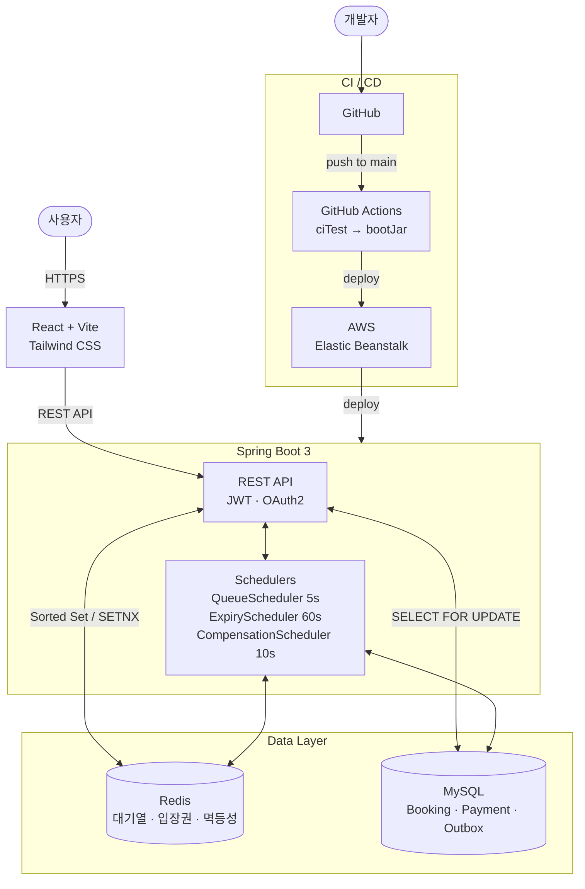
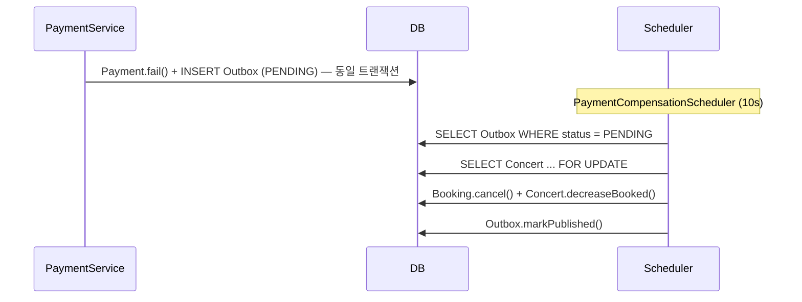

<div align="center">

# Concert Ticket Booking System

**Redis 대기열, Lua Script, Pessimistic Lock, Outbox 패턴으로 고동시성 예매를 안정적으로 처리한 콘서트 티켓팅 시스템**


</div>

---

## 핵심 성과

| 항목 | 결과 |
|---|---|
| 동시성 부하 테스트 | 예약/결제 API 100명 동시 요청 검증 |
| 평균 응답 시간 | 18~21ms |
| 에러율 | 0% |
| 핵심 정합성 | 초과 예매 방지, 중복 결제 차단, 실패 보상 처리 |
| 운영 환경 | Docker Compose, GitHub Actions, AWS Elastic Beanstalk |
| 모니터링 | Prometheus, Grafana 연동 |

> 단순 CRUD가 아니라, **고동시성 상황에서 데이터 정합성을 지키는 구조**를 목표로 설계한 프로젝트입니다.


---

## 문제 상황

콘서트 티켓팅은 특정 시점에 요청이 몰리기 때문에, 일반적인 조회 후 저장 방식만으로는 정합성을 보장하기 어렵습니다.

| 문제 | 설명 |
|---|---|
| 초과 예매 | 여러 사용자가 같은 잔여 좌석을 동시에 선점할 수 있음 |
| 중복 결제 | 네트워크 재시도나 중복 클릭으로 동일 결제가 여러 번 처리될 수 있음 |
| 보상 누락 | 결제 실패 후 좌석이 복구되지 않으면 좌석 상태가 어긋남 |
| 미결제 예약 장기 점유 | 결제를 완료하지 않은 예약이 좌석을 계속 점유할 수 있음 |

---

## 해결 전략 요약

| 전략 | 해결한 문제 | 핵심 방식 |
|---|---|---|
| Redis 대기열 + Lua | 초과 예매 전 단계 제어 | 입장 가능한 사용자만 예매 시도 |
| Pessimistic Lock | 동시 좌석 점유 충돌 | Concert 행 단위 락으로 정합성 확보 |
| 3계층 멱등성 | 중복 결제 | 사전 조회 + Redis SETNX + DB unique key |
| Transactional Outbox | 실패 보상 누락 | 실패 이벤트를 같은 트랜잭션으로 저장 후 재처리 |
| Expiry Scheduler | 방치 예약 정리 | 일정 시간 경과 시 자동 취소 및 좌석 복구 |

---

## 기술 선택 이유

### Redis Sorted Set
고동시성 예매에서는 “누가 먼저 들어왔는가”를 빠르게 판단해야 합니다.  
Sorted Set은 시간 순서를 유지하면서도 대기열 처리 비용이 작아, 입장 순서 제어에 적합했습니다.

### Lua Script
대기열 pop, 입장권 발급, 입장권 소비를 여러 Redis 명령으로 나누면 중간 상태가 생길 수 있습니다.  
Lua Script로 묶어 **원자성**을 보장해 중복 입장이나 순서 꼬임을 줄였습니다.

### Pessimistic Lock
예매는 충돌 빈도가 높은 쓰기 구간입니다.  
이 구간에서 Optimistic Lock보다 Pessimistic Lock이 재시도 비용 없이 정합성을 보장하기 쉬웠습니다.

### 3계층 멱등성
결제는 단순 DB unique key 하나로 막기엔 부족했습니다.  
정상 재시도, 동시 요청, 최후 방어선을 각각 분리해 **사전 조회 + Redis SETNX + DB unique key** 구조로 설계했습니다.

### Transactional Outbox
결제 실패와 좌석 복구를 비동기 호출에 의존하면 이벤트 유실 위험이 있습니다.  
Outbox를 같은 트랜잭션에 저장해 **실패 사실과 보상 이벤트를 함께 남기도록** 설계했습니다.

---

## 기술 스택

### Backend


### Data


-4B4B4B?style=for-the-badge&logoColor=white)

### Frontend


### Infra / Monitoring / Testing


---

## 시스템 흐름

### 서비스 구조



### 예매 플로우


### 결제 실패 보상 플로우



---

## 문제 해결 과정

### 요약

#### 1. 초과 예매 방지
입장 가능한 사용자만 예매를 시도하도록 Redis 대기열을 먼저 두고, 실제 예매 구간에서는 Concert 행에 비관적 락을 걸어 좌석 수를 보호했습니다.

#### 2. 중복 결제 차단
중복 결제는 “이미 처리된 재시도”와 “동시에 들어온 중복 요청”을 분리해서 다뤘습니다.  
그래서 사전 조회, Redis SETNX, DB unique key를 계층적으로 배치했습니다.

#### 3. 결제 실패 보상
결제 실패 후 보상 처리를 즉시 호출하는 방식 대신, 실패 이벤트를 Outbox에 함께 저장하고 Scheduler가 재처리하도록 설계했습니다.

#### 4. 미결제 예약 만료
장시간 결제되지 않은 예약은 Scheduler가 자동으로 취소하고 좌석을 복구하도록 했습니다.

<details>
<summary>상세 보기</summary>

### 1. 초과 예매 방지 — Redis 대기열 + Pessimistic Lock

수백 명이 동시에 `/booking` API를 호출하면, 잔여석 확인과 예매 처리 사이의 타이밍 차이 때문에 초과 예매가 발생할 수 있습니다.

이 프로젝트는 예매를 두 단계로 분리했습니다.

1. Redis Sorted Set에 대기열 등록
2. Scheduler가 Lua Script로 상위 사용자에게 입장권 발급
3. 입장권을 가진 사용자만 예매 가능
4. 예매 시 Concert 행에 `SELECT ... FOR UPDATE`

이 방식으로 입장 제어와 좌석 정합성을 분리해 관리했습니다.

### 2. 중복 결제 차단 — 3계층 멱등성

중복 결제는 한 계층만으로 막기 어렵습니다.

- DB 사전 조회: 정상 재시도 처리
- Redis SETNX: 동시에 들어온 요청 차단
- DB unique key: 최후 방어선

즉, 재시도와 동시성을 같은 문제로 보지 않고 분리해서 대응했습니다.

### 3. 결제 실패 보상 — Transactional Outbox

결제 실패 시 `Payment` 상태만 바뀌고 좌석 복구가 누락되면 데이터가 어긋납니다.

이 프로젝트는 결제 실패와 Outbox 저장을 같은 트랜잭션으로 묶었습니다.

- `Payment.fail()`
- `INSERT PaymentCompensationOutbox`

이후 `PaymentCompensationScheduler`가 `PENDING` 상태 Outbox를 읽어 보상 처리를 수행합니다.  
이 구조는 애플리케이션 장애 이후에도 보상을 이어갈 수 있다는 장점이 있습니다.

### 4. 방치 예매 자동 만료 — Scheduler

결제를 완료하지 않은 `PENDING_PAYMENT` 예약이 계속 좌석을 점유하지 않도록, 일정 시간이 지난 예약은 자동 취소 후 좌석을 복구합니다.

</details>

---

## 성능 테스트 결과

| 항목 | 값 |
|---|---|
| 대상 API | 예약 / 결제 API |
| 동시 사용자 수 | 100명 |
| 평균 응답 시간 | 18~21ms |
| 에러율 | 0% |
| 테스트 도구 | Apache JMeter |
| 검증 환경 | Docker Compose |

100명 동시 요청 환경에서도 초과 예매와 중복 결제가 발생하지 않도록 흐름을 설계했습니다.  
정합성이 필요한 구간만 락과 멱등성 계층으로 보호해 응답 성능과 안정성을 함께 가져가도록 구성했습니다.


---

## 트러블슈팅

### 초과 예매
- 문제: 같은 좌석을 여러 요청이 동시에 예매할 수 있었음
- 해결: 입장권 소비 + Concert 비관적 락 적용
- 결과: 잔여석 1개 상황에서도 1건만 성공

### 중복 결제
- 문제: 재시도와 중복 클릭으로 같은 결제가 여러 번 처리될 수 있었음
- 해결: 사전 조회 + Redis SETNX + DB unique key 적용
- 결과: 동일 `idempotencyKey` 요청은 한 번만 처리

### 결제 실패 보상
- 문제: 결제 실패 후 좌석 상태와 결제 상태가 어긋날 수 있었음
- 해결: Fire-and-forget 대신 Transactional Outbox 채택
- 결과: 실패 이벤트 유실 가능성을 줄이고 재처리 가능한 구조 확보

<details>
<summary>Outbox 선택 이유 자세히 보기</summary>

단순 비동기 호출 방식은 애플리케이션이 중간에 종료되면 보상 로직이 유실될 수 있습니다.

Outbox 패턴은 결제 실패 기록과 보상 이벤트를 같은 트랜잭션에 저장하기 때문에, 실패가 남았다면 보상 대상도 반드시 남습니다.  
이후 Scheduler가 재처리할 수 있어, 즉시 처리 실패가 곧 데이터 유실로 이어지지 않습니다.

</details>

---

## 프로젝트 구조

```text
studying.blog/
├── config/        # JWT, OAuth2, Swagger, QueryDSL, Security
├── controller/    # Booking, Payment, Concert, Queue API
├── domain/        # Concert, Booking, Payment, Outbox 등 핵심 엔티티
├── dto/           # 요청/응답 DTO
├── repository/    # JPA / QueryDSL Repository
├── scheduler/     # Queue / Expiry / Compensation Scheduler
├── service/       # 예매, 결제, 대기열, 토큰 등 비즈니스 로직
├── experiments/   # 전략 비교용 실험 코드
└── frontend/      # React + Vite 기반 UI
```

상세 구조와 흐름 설명은 아래 문서에 정리했습니다.

- [`docs/architecture.md`](docs/architecture.md)
- [`docs/flow.md`](docs/flow.md)
- [`docs/testing.md`](docs/testing.md)
- [`docs/api.md`](docs/api.md)
