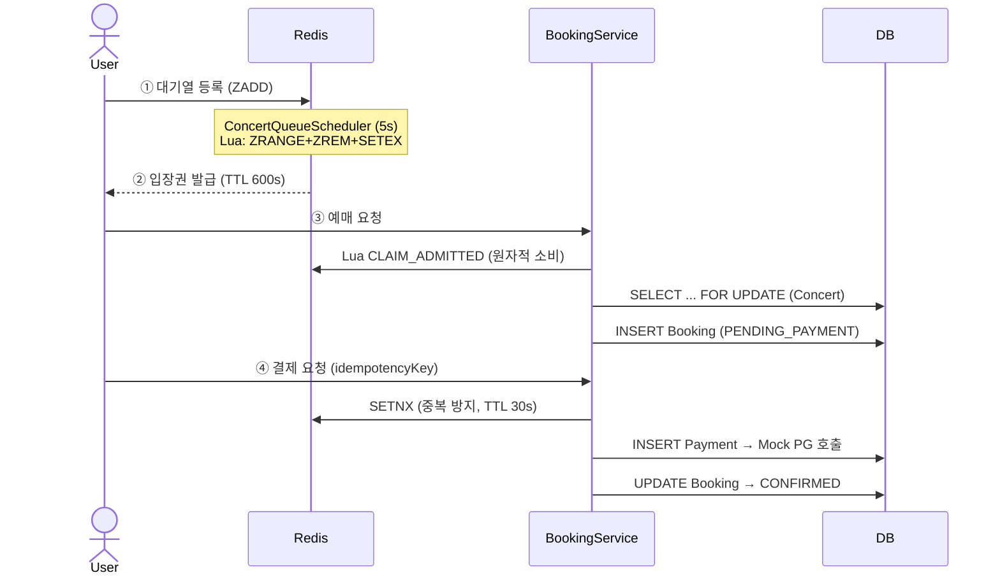
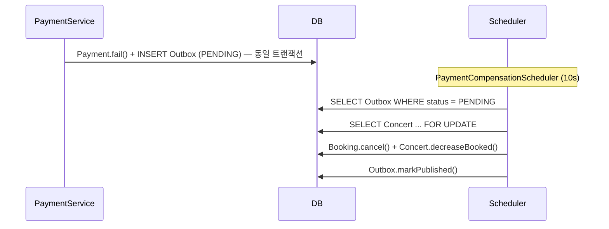

# 🎟️ Concert Ticket Booking System

> Redis 대기열 · Pessimistic Lock · Outbox 패턴으로 고동시성 예매를 안전하게 처리하는 티켓 예매 플랫폼


---

## 🚨 해결한 핵심 문제

| 문제 | 원인 | 해결 전략 |
|------|------|-----------|
| **초과 예매** | 수백 명이 동시에 잔여석 1개를 확인 후 예매 | Redis 대기열 + Pessimistic Lock |
| **중복 결제** | 네트워크 재시도로 동일 요청이 중복 처리 | 3계층 멱등성 (Redis SETNX + DB unique key) |
| **데이터 정합성** | 결제 실패 시 Booking 상태와 좌석 수 불일치 | Transactional Outbox Pattern |
| **방치 예매 누적** | 결제 미완료 예매가 좌석을 무기한 점유 | 30분 자동 만료 스케줄러 |

---

## 🛠 해결 전략

### 1. Redis 대기열 + Lua 스크립트로 공정한 입장 제어

```lua
-- 원자적으로 상위 N명 추출 → 입장권 발급 (ZRANGE + ZREM + SETEX)
local users = redis.call('ZRANGE', queueKey, 0, count - 1)
redis.call('ZREM', queueKey, unpack(users))
for _, userId in ipairs(users) do
  redis.call('SETEX', admittedPrefix .. userId, ttl, '1')
end
```

Sorted Set으로 타임스탬프 기반 순서 보장.  
ZRANGE + ZREM + SETEX를 단일 Lua 스크립트로 묶어 race condition을 원천 차단.

---

### 2. 3계층 멱등성으로 중복 결제 차단

```
[1] DB 조회       → 기존 결제 있으면 즉시 반환 (캐시 역할)
[2] Redis SETNX   → TTL 30s, 동시 요청 블로킹
[3] DB unique key → uk_payment_idempotency_key, 최후 방어선
```

단일 DB 제약만으로는 동시 요청 시 락 경합 발생 → Redis로 앞단에서 차단.

---

### 3. Transactional Outbox로 결제 실패 보상 처리

결제 실패 시 `PaymentCompensationOutbox` 레코드를 **결제와 동일 트랜잭션**에 저장.  
`PaymentCompensationScheduler`(10s 주기)가 폴링하여 좌석 복구 + Booking 취소. 최대 3회 재시도.

> 현재: Outbox(DB) → Scheduler 폴링  
> 향후: Outbox(DB) → Kafka Producer → Consumer (전환 가능 구조로 설계)

---

## 🏗 아키텍처

### 전체 예매 플로우



### 결제 실패 보상 플로우



### Redis 키 구조

| 키 | 타입 | TTL | 용도 |
|----|------|-----|------|
| `queue:concert:{id}` | Sorted Set | — | 대기열 (score = 등록 timestamp) |
| `admitted:concert:{id}:user:{uid}` | String | 600s | 입장권 |
| `payment:idempotency:{key}` | String | 30s | 결제 중복 방지 |

---

## 📊 성능 테스트 결과

> `jmeter/booking-api-50-users.jmx` — SyncTimer로 동시 요청 보장

| 항목 | 결과 |
|------|------|
| 동시 사용자 | <!-- TODO: 실측 후 기입 --> 명 |
| 평균 응답시간 | <!-- TODO --> ms |
| 최대 응답시간 | <!-- TODO --> ms |
| 에러율 | <!-- TODO --> % |
| TPS | <!-- TODO --> |

> ✅ 초과 예매 0건 확인 — 동시성 제어 정상 동작

---

## 🚀 CI/CD

```
Push to main
   │
   ├─ [test]    ./gradlew ciTest  →  JUnit 리포트 아티팩트 업로드
   │
   ├─ [build]   ./gradlew bootJar
   │
   └─ [deploy]  AWS Elastic Beanstalk (ap-northeast-2)
                버전 라벨: github-action-{timestamp}
```

---

## 🔍 기술 선택 이유

| 기술 | 선택 이유 |
|------|-----------|
| **Redis Sorted Set** | 타임스탬프 기반 대기 순서 보장 + O(log N) 성능 |
| **Lua 스크립트** | ZRANGE · ZREM · SETEX를 단일 원자 연산으로 처리, race condition 차단 |
| **Pessimistic Lock** | 예매처럼 충돌 빈도가 높은 구간에서 Optimistic Lock의 재시도 비용 회피 |
| **Outbox Pattern** | Fire-and-forget 대비 장애 시 이벤트 유실 없음, 향후 Kafka 전환 용이 |
| **3계층 멱등성** | DB 제약만으로는 동시 요청 락 경합 발생 → Redis SETNX로 앞단 차단 |

---

## 🧪 Experiments — 기술 선택 근거

프로덕션 구현 전 `experiments/` 패키지에서 전략을 비교 실험하여 근거 있는 기술 선택.

| 패키지 | 실험 주제 | 채택 전략 | 기각 전략 |
|--------|-----------|-----------|-----------|
| `e1` | 쿠폰 재고 관리 | Redis DECR (원자적 감소) | DB SELECT-FOR-UPDATE |
| `e3` | 멱등성 처리 | Redis SETNX + DB unique key | DB INSERT 단독 |
| `e4` | 결제 실패 보상 | Transactional Outbox | Fire-and-forget |

---

## ⚡ 로컬 실행

**사전 조건:** MySQL(3306), Redis(6379) 실행 + 환경변수 설정

```bash
./gradlew bootRun          # 백엔드 (local 프로파일)
cd frontend && npm run dev  # 프론트엔드 (React + Vite)
./gradlew test             # 전체 테스트 (H2 + Redis)
```

> 필수 환경변수: `JWT_SECRET_KEY` · `DB_URL` · `DB_USERNAME` · `DB_PASSWORD` · Google OAuth2 credentials
