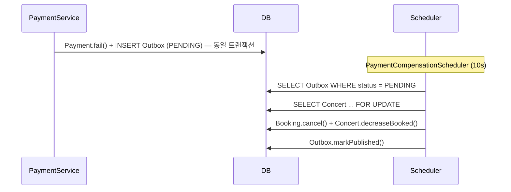

# Concert Ticket Booking System

> Redis 대기열 · Pessimistic Lock · Outbox 패턴으로 고동시성 예매를 안전하게 처리하는 티켓 예매 플랫폼


---

## 목차

- [서비스 개요](#서비스-개요)
- [핵심 문제 요약](#핵심-문제-요약)
- [문제 해결 과정](#문제-해결-과정)
  - [초과 예매 방지 — Redis 대기열 + Pessimistic Lock](#1-초과-예매-방지--redis-대기열--pessimistic-lock)
  - [중복 결제 차단 — 3계층 멱등성](#2-중복-결제-차단--3계층-멱등성)
  - [결제 실패 보상 — Transactional Outbox](#3-결제-실패-보상--transactional-outbox)
  - [방치 예매 자동 만료 — 스케줄러](#4-방치-예매-자동-만료--스케줄러)
- [아키텍처](#아키텍처)
- [성능 테스트 결과](#성능-테스트-결과)
- [CI/CD](#cicd)
- [기술 선택 이유](#기술-선택-이유)
- [Experiments — 기술 선택 근거](#experiments--기술-선택-근거)
- [로컬 실행](#로컬-실행)

---

## 서비스 개요

콘서트 티켓팅처럼 **특정 시간에 수백~수천 명이 동시에 몰리는 환경**에서는 일반적인 웹 서비스 설계로는 한계가 있습니다.

- 동시에 잔여석을 확인한 여러 사용자가 모두 예매에 성공하는 **초과 예매**
- 결제 버튼을 두 번 눌렀을 때 **중복 결제**가 발생하는 문제
- 결제가 실패했는데도 **좌석이 복구되지 않아** 다른 사용자가 예매할 수 없는 상태

이 프로젝트는 위 문제들을 실제 프로덕션 수준의 기술로 해결하는 것을 목표로 설계되었습니다.

**핵심 예매 플로우:**

```
대기열 등록 → 입장권 발급 → 예매(Booking) → 결제(Payment)
```

각 단계는 Redis 원자 연산, DB 비관적 락, 멱등성 키로 보호되며,  
결제 실패 시에는 Outbox 패턴을 통해 좌석이 반드시 복구됩니다.

---

## 핵심 문제 요약

| 문제 | 원인 | 해결 전략 |
|------|------|-----------|
| **초과 예매** | 동시 다수 요청이 동일 잔여석을 확인 후 예매 진행 | Redis 대기열 + Pessimistic Lock |
| **중복 결제** | 네트워크 재시도로 동일 결제 요청이 반복 처리 | 3계층 멱등성 (Redis SETNX + DB unique key) |
| **데이터 정합성** | 결제 실패 시 Booking 상태와 잔여석 불일치 | Transactional Outbox Pattern |
| **방치 예매 누적** | 결제 미완료 예매가 좌석을 무기한 점유 | 30분 자동 만료 스케줄러 |

---

## 문제 해결 과정

### 1. 초과 예매 방지 — Redis 대기열 + Pessimistic Lock

**문제 상황**

수백 명이 동시에 `/booking` API를 호출하면, 잔여석 확인과 예매 처리 사이에 타이밍 차이가 생깁니다.  
잔여석이 1개일 때 10개의 스레드가 동시에 "잔여석 있음"을 확인하면 10건이 모두 예매될 수 있습니다.

**기존 방식의 한계**

- **DB SELECT 후 INSERT 방식**: 조회와 삽입 사이의 gap에서 race condition 발생
- **Optimistic Lock**: 충돌 시 재시도가 필요하며, 동시 요청이 많을수록 재시도 폭발적 증가

**선택한 해결 방법**

예매를 두 단계로 분리했습니다.

1. **대기열 단계**: Redis Sorted Set(score = 등록 timestamp)에 사용자를 등록. `ConcertQueueScheduler`(5s)가 Lua 스크립트로 상위 50명을 원자적으로 추출해 입장권(TTL 600s)을 발급합니다.

2. **예매 단계**: 입장권을 소지한 사용자만 예매를 시도할 수 있으며, Concert 행에 `SELECT ... FOR UPDATE`(Pessimistic Lock)를 걸어 단일 트랜잭션에서 잔여석 감소와 Booking 생성을 처리합니다.

```lua
-- ConcertQueueScheduler: 원자적으로 상위 N명 추출 → 입장권 발급
local users = redis.call('ZRANGE', queueKey, 0, count - 1)
redis.call('ZREM', queueKey, unpack(users))
for _, userId in ipairs(users) do
  redis.call('SETEX', admittedPrefix .. userId, ttl, '1')
end
```

**왜 이 방법인가**

- ZRANGE + ZREM + SETEX를 Lua 스크립트 하나로 묶어 원자성 보장 — 입장권 중복 발급 원천 차단
- Pessimistic Lock은 충돌 빈도가 높은 단발성 쓰기 구간에서 Optimistic Lock의 재시도 비용을 제거

**적용 결과**

- 동시 10스레드로 잔여석 1개에 예매 요청 시 정확히 1건만 성공 (`EnrollConcurrencyTest` 검증)
- 대기열 순서 공정성 보장

---

### 2. 중복 결제 차단 — 3계층 멱등성

**문제 상황**

사용자가 결제 버튼을 빠르게 두 번 누르거나, 네트워크 오류로 클라이언트가 동일 요청을 재전송할 경우 결제가 중복 처리될 수 있습니다.

**기존 방식의 한계**

- **DB unique key 단독**: 두 요청이 동시에 들어오면 INSERT 전에 둘 다 통과하여 DB 레벨에서 lock 경합 발생
- **DB 사전 조회 단독**: 조회와 INSERT 사이 gap에서 동시 요청 허용 가능

**선택한 해결 방법**

```
[1] DB 사전 조회        → 이미 처리된 결제이면 즉시 반환 (정상 재시도 대응)
[2] Redis SETNX         → TTL 30s, 동시 요청을 앞단에서 블로킹
[3] DB unique constraint → uk_payment_idempotency_key, 최후 방어선
```

클라이언트는 결제 요청 시 `idempotencyKey`를 헤더로 전달합니다. 3개 계층이 순서대로 동작하므로 정상 재시도(DB 조회 단락)와 동시 중복 요청(Redis 블로킹) 모두 처리합니다.

**왜 이 방법인가**

각 계층이 다른 유형의 중복을 담당합니다. DB 조회는 기존 결제 재조회에 최적화되어 있고, Redis SETNX는 동시성 문제에 특화되어 있으며, DB 제약은 두 계층이 모두 실패할 경우의 최후 보장입니다.

**적용 결과**

- 동일 `idempotencyKey`로 동시 10요청 시 1건만 처리 (`PaymentServiceFailRateTest` 검증)
- Redis 락 해제는 `finally` 블록에서 보장되어 30s 내 재시도 가능

---

### 3. 결제 실패 보상 — Transactional Outbox

**문제 상황**

PG(결제 대행사) 실패 시 `Payment` 상태를 FAILED로 변경해야 하고, `Booking` 상태를 CANCELLED로 변경하고 잔여석을 복구해야 합니다. 이 두 작업이 분리된 트랜잭션이면 한쪽이 실패했을 때 데이터 불일치가 발생합니다.

**기존 방식의 한계**

- **Fire-and-forget (별도 스레드 호출)**: 애플리케이션 크래시 시 이벤트 유실, 보상 처리 미실행
- **동기 보상 처리**: PG 실패와 보상 처리를 같은 트랜잭션에 묶으면 범위가 넓어져 락 보유 시간 증가

**선택한 해결 방법**

결제 실패 시 `PaymentCompensationOutbox` 레코드를 **결제 트랜잭션과 동일한 커밋**에 저장합니다.  
`PaymentCompensationScheduler`(10s 주기)가 `PENDING` 상태의 Outbox를 폴링하여 보상을 처리합니다.

```
결제 트랜잭션
  ├─ Payment.fail()
  └─ INSERT PaymentCompensationOutbox (PENDING)   ← 같은 커밋

PaymentCompensationScheduler (10s)
  ├─ SELECT Concert ... FOR UPDATE
  ├─ Booking.cancel() + Concert.decreaseBooked()
  └─ Outbox.markPublished()
```

보상 처리는 멱등성이 보장됩니다. Booking이 이미 CANCELLED이면 Outbox를 PUBLISHED로 처리하고 종료합니다. 최대 3회 재시도 후 FAILED로 마킹합니다.

**왜 이 방법인가**

- Outbox와 결제가 같은 트랜잭션에 묶이므로 결제 실패가 커밋되면 Outbox도 반드시 존재
- 애플리케이션 크래시 후 재시작해도 PENDING Outbox를 재처리하여 보상 누락 없음
- 현재 Scheduler 폴링 방식이지만, Outbox → Kafka Producer → Consumer 구조로 전환 가능하도록 인터페이스를 분리

**적용 결과**

- 결제 실패율 50% 환경에서 모든 실패 건의 좌석이 복구됨 (`PaymentCompensationSchedulerTest` 검증)
- 보상 처리 멱등성: 동일 Outbox 중복 처리 시 좌석 이중 복구 없음

---

### 4. 방치 예매 자동 만료 — 스케줄러

**문제 상황**

예매 후 결제를 완료하지 않은 `PENDING_PAYMENT` 상태의 Booking이 좌석을 계속 점유합니다.  
이로 인해 다른 사용자가 예매할 수 없는 상황이 지속될 수 있습니다.

**선택한 해결 방법**

`BookingExpiryScheduler`(60s 주기)가 생성 후 30분이 경과한 `PENDING_PAYMENT` Booking을 일괄 조회합니다.  
Concert ID별로 그룹핑하여 Concert 당 락을 1회만 획득한 뒤 일괄 취소 처리합니다.

**왜 이 방법인가**

콘서트별 그룹핑으로 락 획득 횟수를 최소화하고, 동일 Concert의 만료 Booking을 하나의 트랜잭션에서 처리합니다.

**적용 결과**

- 30분 경과 PENDING_PAYMENT Booking 자동 취소 + 잔여석 복구 (`BookingExpirySchedulerTest` 검증)

---

## 아키텍처

### 전체 예매 플로우


### 결제 실패 보상 플로우



### Redis 키 구조

| 키 | 타입 | TTL | 용도 |
|----|------|-----|------|
| `queue:concert:{id}` | Sorted Set | — | 대기열 (score = 등록 timestamp) |
| `admitted:concert:{id}:user:{uid}` | String | 600s | 입장권 |
| `payment:idempotency:{key}` | String | 30s | 결제 중복 방지 |

---

## 성능 테스트 결과

> `jmeter/booking-api-50-users.jmx` — SyncTimer로 동시 요청 보장

| 항목 | 결과 |
|------|------|
| 동시 사용자 | <!-- TODO: 실측 후 기입 --> 명 |
| 평균 응답시간 | <!-- TODO --> ms |
| 최대 응답시간 | <!-- TODO --> ms |
| 에러율 | <!-- TODO --> % |
| TPS | <!-- TODO --> |

> 초과 예매 0건 확인 — 동시성 제어 정상 동작

---

## CI/CD

```
Push to main
   │
   ├─ [test]    ./gradlew ciTest  →  JUnit 리포트 아티팩트 업로드
   │
   ├─ [build]   ./gradlew bootJar
   │
   └─ [deploy]  AWS Elastic Beanstalk (ap-northeast-2)
                버전 라벨: github-action-{timestamp}
```

---

## 기술 선택 이유

| 기술 | 선택 이유 |
|------|-----------|
| **Redis Sorted Set** | 타임스탬프 기반 대기 순서 보장 + O(log N) 성능 |
| **Lua 스크립트** | ZRANGE · ZREM · SETEX를 단일 원자 연산으로 처리, race condition 차단 |
| **Pessimistic Lock** | 충돌 빈도가 높은 예매 구간에서 Optimistic Lock의 재시도 비용 제거 |
| **Outbox Pattern** | Fire-and-forget 대비 장애 시 이벤트 유실 없음, Kafka 전환 가능 구조 |
| **3계층 멱등성** | DB 제약 단독으로는 동시 요청 시 lock 경합 → Redis SETNX로 앞단 차단 |

---

## Experiments — 기술 선택 근거

프로덕션 구현 전 `experiments/` 패키지에서 전략별 실험을 수행하고 결과를 근거로 기술을 선택했습니다.

| 패키지 | 실험 주제 | 채택 전략 | 기각 전략 |
|--------|-----------|-----------|-----------|
| `e1` | 쿠폰 재고 관리 | Redis DECR (원자적 감소) | DB SELECT-FOR-UPDATE |
| `e3` | 멱등성 처리 | Redis SETNX + DB unique key | DB INSERT 단독 |
| `e4` | 결제 실패 보상 | Transactional Outbox | Fire-and-forget |

각 실험은 동일 인터페이스(`Strategy`)로 구현한 뒤 동시성 테스트로 비교했으며,  
실험 코드는 `experiments/` 패키지에서 확인할 수 있습니다.

---

## 로컬 실행

**사전 조건:** MySQL(3306), Redis(6379) 실행 + 환경변수 설정

```bash
./gradlew bootRun          # 백엔드 (local 프로파일)
cd frontend && npm run dev  # 프론트엔드 (React + Vite)
./gradlew test             # 전체 테스트 (H2 + Redis)
```

**필수 환경변수**

| 변수 | 설명 |
|------|------|
| `JWT_SECRET_KEY` | Base64 인코딩된 JWT 시크릿 |
| `DB_URL` | `jdbc:mysql://localhost:3306/blog` |
| `DB_USERNAME` / `DB_PASSWORD` | MySQL 계정 |
| `SPRING_SECURITY_OAUTH2_CLIENT_REGISTRATION_GOOGLE_CLIENT_ID` | Google OAuth2 |
| `SPRING_SECURITY_OAUTH2_CLIENT_REGISTRATION_GOOGLE_CLIENT_SECRET` | Google OAuth2 |
