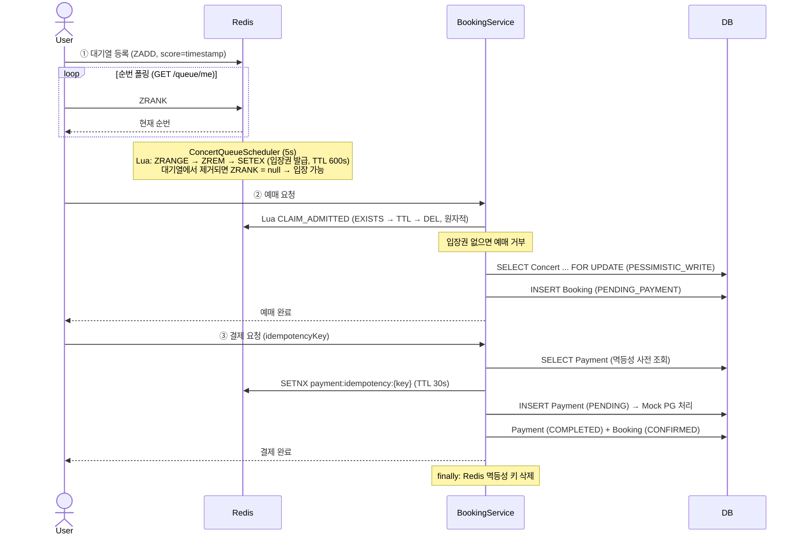
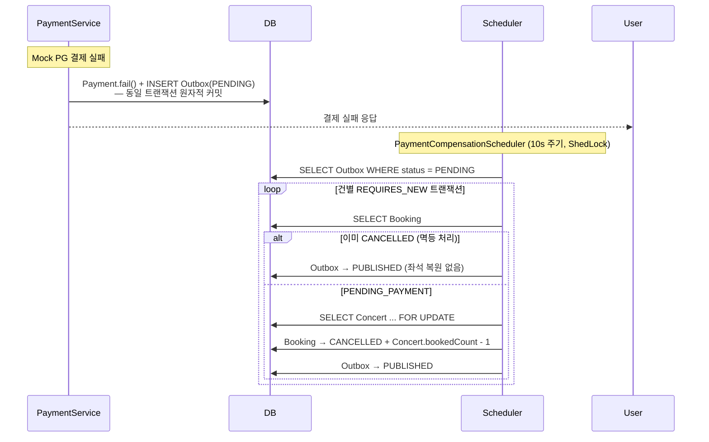

<div align="center">

# 🎊TicketFlow🎊

**동시성 티켓팅 환경에서 초과 예매·중복 결제·보상 누락을 직접 재현하고, 각 문제를 독립적으로 해결한 백엔드 프로젝트입니다.**

</div>

---

## 🙋‍♂️ 프로젝트 소개

"동시에 100명이 좌석 1개에 몰리면 어떻게 될까?" 라는 질문에서 시작했습니다.

단순한 CRUD 구조에서는 아래 문제들이 발생합니다.

| 문제 | 원인 |
|---|---|
| **초과 예매** | 잔여석 확인과 INSERT 사이 타이밍 차이 |
| **중복 결제** | 네트워크 재시도 또는 동시 중복 요청 |
| **보상 누락** | 결제 실패 후 좌석 복구 로직 유실 |
| **방치 예약** | 미결제 예약의 좌석 장기 점유 |

각 문제를 `experiments/` 패키지에서 전략별로 직접 실험해 한계를 확인했고, 그 결과를 실제 구현에 반영했습니다.

- Redis Sorted Set + Lua Script — 선착순 입장 순서를 원자적으로 제어
- `SELECT ... FOR UPDATE` — 최종 좌석 차감 구간의 동시성 충돌 방지
- DB 사전 조회 → Redis SETNX → DB unique key — 3계층 멱등성으로 중복 결제 차단
- Transactional Outbox — 결제 실패와 보상 이벤트를 같은 트랜잭션에 묶어 유실 방지

---

## 📂 프로젝트 구조

```text
ticketflow/
├── backend/
│   ├── config/        # JWT, OAuth2, Security, ShedLock
│   ├── controller/    # Booking, Payment, Concert, Queue API
│   ├── domain/        # Concert, Booking, Payment, Outbox 핵심 엔티티
│   ├── dto/           # 요청/응답 DTO
│   ├── repository/    # JPA Repository (Pessimistic Lock 쿼리 포함)
│   ├── scheduler/     # QueueScheduler / ExpiryScheduler / CompensationScheduler
│   ├── service/       # 예매, 결제, 대기열, 쿠폰 비즈니스 로직
│   └── experiments/   # 전략 비교 실험 코드 (e1 쿠폰 / e3 멱등성 / e4 보상)
└── frontend/          # React + Vite UI
```

---

## 🛠️ 기술 스택

### Backend


### Data


-4B4B4B?style=for-the-badge&logoColor=white)

### Frontend


### Infra / Monitoring / Testing


---

## ⚡️ 주요 기능

- **Redis 대기열** — Sorted Set으로 선착순 입장 제어, Scheduler가 Lua 스크립트로 상위 50명에게 원자적으로 입장권 발급
- **비관적 락 예매** — 입장권 소비 + `SELECT ... FOR UPDATE`로 좌석 수 정합성 보호
- **3계층 멱등성** — DB 사전 조회 → Redis SETNX → DB unique key 계층적 중복 결제 차단
- **Transactional Outbox** — 결제 실패와 보상 이벤트를 같은 트랜잭션에 저장, Scheduler 재처리 (최대 3회)
- **입장권 복원** — 예매 중 DB 처리 실패 시 입장권을 원래 TTL로 복원해 재시도 허용
- **자동 만료** — 30분 방치된 `PENDING_PAYMENT` 예약 자동 취소 및 좌석 복원
- **보안 2-chain** — `/api/**` JWT STATELESS + `/**` OAuth2/Google 세션 이중 구조
- **Toss API Circuit Breaker** — 외부 결제 API 장애 시 fallback 처리 및 타임아웃 분리
- **ShedLock** — 다중 인스턴스 환경에서 Scheduler 중복 실행 방지

---

## 🔄 시스템 아키텍처 및 플로우

### MVP 시스템 아키텍쳐


### 예매 플로우



### 결제 실패 보상 플로우



---

## 💡 기술적 의사결정

단순히 기술 목록을 나열하기보다, 각 결정에 이르기까지 어떤 고민을 했는지 기록합니다.

<details>
<summary><strong>Redis Sorted Set + Lua Script — 대기열을 어떻게 구현할 것인가</strong></summary>

### 고민의 시작

처음에는 DB 테이블 하나로 대기열을 구현하려 했습니다. `INSERT INTO queue (user_id, created_at)` 후 `COUNT(*)` 로 순번을 계산하면 되지 않을까 싶었습니다.

그런데 생각해보니 티켓팅 오픈 순간 수백 명이 동시에 순번을 조회합니다. 매번 `COUNT(*)` 를 날리면 조회마다 전체 테이블을 읽고, 폴링 주기가 짧을수록 DB 부하가 선형으로 올라갑니다. 대기열 특성상 읽기가 쓰기보다 훨씬 많다는 게 문제였습니다.

### 선택지 검토

- **DB 테이블** — 구현이 단순하지만, 순번 조회 쿼리가 폴링마다 반복돼 고동시성에서 DB 부하 집중
- **Redis List** — LPUSH/LINDEX 로 순번 조회 가능하지만, 중간 삭제(입장 처리) 시 O(N)
- **Redis Sorted Set** — score 기준 정렬, ZRANK 로 O(log N) 순번 조회, ZREM 으로 O(log N) 삭제

Sorted Set이 가장 적합했습니다. score를 등록 타임스탬프로 설정하면 선착순 순서가 자동으로 유지됩니다.

### Lua Script가 필요했던 이유

Sorted Set을 선택하고 보니 새 문제가 생겼습니다. 입장권을 발급하는 과정이 `ZRANGE → ZREM → SETEX` 세 단계인데, 이 사이에 스케줄러가 두 번 실행되거나 예외가 생기면 어떻게 될까요?

- ZREM은 됐는데 SETEX 전에 프로세스가 죽으면 → 대기열에서 빠졌지만 입장권이 없는 사용자 발생
- 스케줄러가 거의 동시에 두 번 실행되면 → 같은 사용자에게 입장권 중복 발급

Java에서 순차 호출하면 원자성이 없습니다. Redis MULTI/EXEC 트랜잭션도 고려했지만, WATCH 없이는 CAS가 안 되고 WATCH를 쓰면 경합 시 재시도 로직이 필요해졌습니다.

Lua Script는 Redis에서 원자적으로 실행됩니다. 스크립트 실행 중 다른 명령이 끼어들 수 없습니다. 세 단계를 하나의 스크립트로 묶으면 문제가 해결됩니다.

```lua
-- POP_AND_GRANT: 대기열 상위 N명을 꺼내 입장권 발급 (원자적)
local users = redis.call('ZRANGE', queueKey, 0, count - 1)
if (#users == 0) then return users end
redis.call('ZREM', queueKey, unpack(users))
for i = 1, #users do
  redis.call('SETEX', admittedPrefix .. users[i], ttl, '1')
end
return users
```

입장권 소비(`EXISTS → DEL`)도 같은 이유로 Lua Script를 사용합니다. 두 명령 사이에 TTL 만료가 끼어드는 TOCTOU 를 방지합니다. 반환값으로 남은 TTL을 받아, DB 처리 실패 시 입장권을 원래 잔여 TTL로 복원하는 데 활용했습니다.

```lua
-- CLAIM_ADMITTED: 입장권 확인 + 원자적 소비, 남은 TTL 반환
if redis.call('EXISTS', key) == 0 then return -1 end
local ttl = redis.call('TTL', key)
redis.call('DEL', key)
return ttl
```

</details>

<details>
<summary><strong>Pessimistic Lock — 낙관적 락을 먼저 써보고 바꾼 이유</strong></summary>

### 처음 접근

동시성 문제를 처음 접했을 때 자연스럽게 Optimistic Lock을 떠올렸습니다. `@Version` 하나 붙이고 충돌 시 재시도하면 된다는 생각이었습니다. 락을 잡지 않으니 처리량도 높을 것 같았습니다.

그런데 직접 실험해보니 문제가 드러났습니다.

### 티켓팅 환경의 특수성

티켓팅 오픈 순간에는 수십 명이 동시에 같은 콘서트의 마지막 좌석을 노립니다. Optimistic Lock에서 충돌은 "가끔 발생하는 예외 상황"이 아니라 "거의 항상 발생하는 정상 상태"입니다.

```
[낙관적 락 시나리오]
50개 스레드 동시 요청 → 1개만 커밋 성공 → 49개 OptimisticLockException
→ 재시도 → 또 충돌 → 재시도 무한 반복
→ 응답 지연 누적, DB 커넥션 점유 증가
```

재시도 횟수를 제한해도 결국 실패한 요청들이 에러를 반환하는 건 동일합니다. Optimistic Lock의 장점(처리량)은 충돌이 드문 경우에 의미가 있는데, 이 구간은 충돌이 오히려 필연적입니다.

### 선택 이유

Pessimistic Lock은 락을 잡은 트랜잭션이 처리를 완료할 때까지 다른 트랜잭션이 대기합니다. 재시도 없이 순차 처리됩니다.

잔여석 차감 자체는 빠른 연산입니다. 락 유지 시간이 짧으면 대기 비용이 크지 않습니다. "빈번한 충돌 + 짧은 크리티컬 섹션"이라는 특성에 Pessimistic Lock이 더 맞았습니다.

Redis 대기열이 이미 진입 인원을 50명 단위로 나눠 입장시키므로, 실제 동시에 좌석을 차감하는 인원도 제한됩니다. 락 경합 자체가 많지 않다는 것도 고려했습니다.

`EnrollConcurrencyTest` — 10스레드 동시 예매 시 정확히 1건만 성공함을 검증했습니다.

</details>

<details>
<summary><strong>3계층 멱등성 — "unique key 하나면 되지 않나"에서 시작한 고민</strong></summary>

### 처음 생각

처음에는 DB에 `uk_payment_idempotency_key` unique constraint 하나를 두면 충분하다고 생각했습니다. 중복 요청이 들어오면 INSERT가 실패하고, 호출자가 이미 처리됐다는 걸 알 수 있으니까요.

`experiments/e3`에서 세 전략을 각각 실험하면서 이 생각이 틀렸다는 걸 확인했습니다.

### 각 전략의 한계

**전략 A (DB unique key만)**
중복 요청이 거의 동시에 들어오면 두 요청 모두 비즈니스 로직 초반을 통과합니다. INSERT 시점에야 충돌이 드러나는데, 그 전에 이미 결제 관련 로직이 실행된 상태입니다. 충돌을 앞단에서 차단하지 못합니다.

또 이미 성공한 결제를 사용자가 재시도하는 경우, unique constraint 예외로 처리하면 "결제 실패"처럼 보입니다. 기존 결과를 그대로 반환하는 것이 더 자연스럽습니다.

**전략 B (SELECT EXISTS → INSERT)**
이미 처리된 재시도는 빠르게 걸러낼 수 있습니다. 하지만 SELECT와 INSERT 사이에 동시 요청이 끼어들면 둘 다 SELECT에서 "없음"을 보고 INSERT로 진입합니다.

**전략 C (Redis SETNX only)**
동시 요청 차단은 효과적이지만, Redis가 장애 상태면 방어선이 통째로 사라집니다.

### 설계

각 전략이 서로 다른 상황에서 무너진다는 걸 확인하고, 세 계층을 조합했습니다. 각 계층이 서로 다른 실패 시나리오를 담당합니다.

| 계층 | 역할 | 대응 상황 |
|---|---|---|
| DB 사전 조회 | 이미 처리된 요청이면 기존 결과 즉시 반환 | 정상 재시도 |
| Redis SETNX (TTL 30s) | 동일 키의 동시 요청을 앞단에서 차단 | 동시 중복 클릭 |
| DB unique key | Redis 장애 시 최후 방어선 | Redis 장애 |

</details>

<details>
<summary><strong>Transactional Outbox — 실패를 직접 목격하고 나서 선택한 패턴</strong></summary>

### 처음 구조

결제 실패 시 즉시 보상 로직을 호출하는 방식(Fire-and-forget)으로 먼저 구현했습니다. 직관적이고 단순합니다. `paymentService.fail()` 이후 바로 `bookingService.cancel()`을 호출하면 됩니다.

### 실험에서 확인한 문제

`experiments/e4`에서 N번째 호출마다 예외를 주입하는 방식으로 실패율을 시뮬레이션했습니다. 일정 비율의 결제 실패를 주입하자, 보상 호출 자체도 같은 비율로 실패했습니다. 결제는 실패했는데 좌석 복원은 안 된 케이스가 발생했습니다.

실서비스 환경에서는 이게 더 심각합니다. 앱 재시작, 네트워크 순단, 예외 발생 — 보상 호출이 끊길 수 있는 지점이 너무 많습니다.

### 핵심 문제 의식

"결제 실패"와 "보상 대상 기록"이 별개의 작업으로 분리돼 있다는 게 근본 문제였습니다. 결제 실패는 DB에 남는데, 보상 대상은 메모리나 비동기 호출 흐름 안에만 있습니다. 앱이 죽으면 보상 대상 정보가 사라집니다.

```
Fire-and-forget:
  결제 실패 (DB에 기록) → 보상 호출 → 앱 종료 → 이벤트 유실
  재시작 후: 결제 실패 기록은 있지만, 보상을 해야 한다는 정보가 없음
```

### Outbox의 보장

Outbox 패턴은 "결제 실패"와 "보상해야 한다는 사실"을 같은 트랜잭션에 저장합니다. 이 두 가지가 원자적으로 커밋됩니다. 결제 실패가 DB에 남아있으면 보상 대상 Outbox도 반드시 남아있습니다.

```
Outbox 패턴:
  [같은 트랜잭션] Payment.fail() + INSERT Outbox(PENDING)
  앱 재시작 후에도 Outbox가 남아 Scheduler가 재처리
```

실험에서 동일한 실패율을 주입했을 때, Outbox 방식은 스케줄러 재처리를 통해 최종 100% 보상 성공을 확인했습니다.

각 Outbox는 `REQUIRES_NEW` 트랜잭션으로 독립 처리되며, 최대 3회 재시도 후 `FAILED`로 전환되어 Grafana 알림을 발송합니다.

</details>

<details>
<summary><strong>Circuit Breaker + Timeout — 외부 장애를 내 서비스 안으로 얼마나 들일 것인가</strong></summary>

### 문제 의식

Toss API 연동을 처음 구현할 때는 `PaymentService` 안에서 직접 HTTP 호출을 했습니다. 기능적으로는 문제없이 동작했습니다.

그런데 외부 API가 응답하지 않을 때 어떻게 될지 생각해봤습니다. HTTP 요청을 보낸 스레드는 타임아웃이 날 때까지 블로킹됩니다. 타임아웃 설정이 없으면 무한정 대기할 수 있습니다. 동시에 여러 요청이 들어오면 스레드 풀이 순식간에 고갈됩니다.

외부 시스템의 장애가 내 서비스 전체로 전파되는 구조였습니다.

### 설계 방향

- **타임아웃 분리**: 외부 API 호출은 connect 3s, read 3s 로 제한. 스레드 점유 시간을 명시적으로 제어
- **Circuit Breaker**: 연속 실패 임계치 초과 시 빠르게 차단. 회복 불가능한 외부 장애에 계속 요청을 보내는 낭비를 줄임
- **별도 fallback 없음**: Circuit Breaker나 timeout 예외도 기존 `catch` 블록의 `payment.fail()` + Outbox 저장 경로로 합류. 장애 보호 로직을 추가하면서도 기존 보상 흐름을 그대로 유지

외부 API 연동에서 중요한 건 성공 경로만큼이나 "실패했을 때 내 서비스가 얼마나 빠르게 회복하고, 어떤 흔적을 남기느냐"라고 생각했습니다.

</details>

---

## 📈 부하 테스트 및 성능

동시 사용자 **100명**으로 예매 → 결제 전체 플로우를 부하 테스트했습니다.
로컬 환경이므로 절대적인 응답 시간보다, 동시 요청 상황에서도 데이터 정합성이 깨지지 않는 것을 핵심 지표로 삼았습니다.

<details>
<summary><strong>부하 테스트 상세 보기</strong></summary>

### 핵심 결과 요약

| 지표 | 결과 |
|---|---|
| 동시 사용자 | **100명** |
| 평균 응답 시간 | **18~21ms** |
| 에러율 | **0%** |
| 초과 예매 | **0건** |
| 중복 결제 | **0건** |

---

<details>
<summary><strong>JMeter — 성능 측정</strong></summary>


*100건 동시 요청 기준. 평균 18ms, 에러율 0%, 처리량 5.0 req/sec.*

Pessimistic Lock과 Redis SETNX 기반 멱등성 제어가 동시 트래픽 하에서도 정상 작동했습니다.

| 항목 | 값 |
|---|---|
| 도구 | Apache JMeter 5.6.3 |
| 대상 API | 예매 API, 결제 API |
| 평균 / 최소 / 최대 | 18ms / 10ms / 113ms |
| 처리량 | 5.0 req/sec |
| 실행 환경 | Docker Compose (로컬) |

</details>

<details>
<summary><strong>Grafana — 정합성 모니터링</strong></summary>


*예매 성공률 100%, 결제 성공률 100%. 결과 분포 기준으로 정합성 검증.*

예매/결제 결과 분포에서 `ALREADY_BOOKED`와 `MOCK/CACHED`가 기록되었습니다.
이는 중복 요청이 실제로 발생했음에도 시스템이 정상적으로 차단했다는 직접적인 근거입니다.

| 분포 항목 | 의미 |
|---|---|
| `BOOKED` | 예매 성공 |
| `ALREADY_BOOKED` | 중복 예매 시도 → 차단됨 |
| `SOLD_OUT` | 잔여석 없음 |
| `MOCK/COMPLETED` | 결제 성공 |
| `MOCK/CACHED` | 멱등성 키로 재반환 (중복 결제 차단) |

</details>

</details>

---

## 💾 DB 성능 튜닝

<details>
<summary><strong>DB 인덱스 최적화 — 스케줄러 쿼리가 느리다는 걸 확인하고 나서</strong></summary>

### 문제 의식

`BookingExpiryScheduler`는 60초마다 아래 쿼리를 실행합니다.

```sql
SELECT * FROM booking
WHERE status = 'PENDING_PAYMENT'
  AND created_at < NOW() - INTERVAL 30 MINUTE
ORDER BY created_at ASC
LIMIT 1000;
```

처음에는 "스케줄러 쿼리니까 응답 시간이 좀 길어도 괜찮겠지"라고 생각했습니다. 그런데 데이터가 쌓일수록 이 쿼리가 부담이 된다는 걸 확인하고 싶었습니다. 10만 건 데이터를 넣고 `EXPLAIN`을 실행했습니다.

**Before — EXPLAIN**


`type=ALL`, `key=NULL` — 인덱스를 전혀 사용하지 않고 10만 건 전체를 읽은 뒤 조건 필터링을 합니다. 예상대로였지만 직접 확인하니 심각성이 달랐습니다.

**Before — 실행 시간 (5회 평균)**


평균 **45~50ms**. 60초마다 실행되는 쿼리가 한 번에 50ms를 쓰고, 데이터가 늘수록 선형으로 악화됩니다.

### 인덱스 설계 고민

`status` 단독 인덱스와 `(status, created_at)` 복합 인덱스 두 가지를 고려했습니다.

- `status` 단독: `PENDING_PAYMENT` 건만 골라낼 수 있지만, 그 이후 `created_at` 범위 필터는 여전히 필터링
- `(status, created_at)` 복합: status로 먼저 범위를 좁힌 뒤 created_at 순서로 바로 읽어나갈 수 있음

쿼리에서 `status =` 조건이 등치 비교이고 `created_at <` 가 범위 조건이라 복합 인덱스의 컬럼 순서가 중요합니다. status를 앞에 두면 created_at 범위 스캔을 인덱스 안에서 처리할 수 있습니다.

```sql
CREATE INDEX idx_booking_status_created_at ON booking(status, created_at);
```

**After — EXPLAIN**


`type=range`, `key=idx_booking_test_status_created_at`, `Using index condition` — Index Range Scan으로 전환됩니다.

**After — 실행 시간 (5회 평균)**


평균 **1.7~2.2ms**.

### 결과 요약

| 항목 | Before | After |
|---|---|---|
| 실행 계획 | `type=ALL` (Full Table Scan) | `type=range` (Index Range Scan) |
| 사용 인덱스 | `NULL` | `idx_booking_status_created_at` |
| 평균 실행 시간 | ~45ms | ~2ms |

> 만료 조회 쿼리(`created_at < X`)는 조건 범위가 넓어 인덱스 후에도 읽는 데이터가 어느 정도 있습니다.  
> 양쪽 범위로 제한된 쿼리에서는 약 22배 개선도 확인했습니다.

</details>

---

## 🚨 트러블슈팅

<details>
<summary><strong>할인 콘서트 결제 시 "결제 금액이 일치하지 않습니다" 오류</strong></summary>

### 문제 상황

할인율이 적용된 콘서트에서 결제 버튼을 누르면 항상 `결제 금액이 일치하지 않습니다` 오류가 발생했습니다. 할인 없는 콘서트는 정상 결제됐습니다.

### 이상하게 느낀 지점

프론트엔드는 API 응답의 `discountedPrice` 를 그대로 결제 금액으로 전송합니다. 서버가 직접 계산해서 내려준 값인데 왜 검증에서 실패할까요? 처음엔 프론트가 잘못된 값을 보내는 건지 의심했습니다. 실제 요청 페이로드를 찍어보니 금액은 맞았습니다.

### 원인을 찾기 위한 가설

서버 쪽 금액 검증 로직을 확인해보니 문제를 바로 찾았습니다.

```java
// Before: 할인 여부와 관계없이 원가로만 검증
if (!request.getAmount().equals(concert.getPrice())) {
    throw new IllegalArgumentException("결제 금액이 일치하지 않습니다.");
}
```

할인 기능을 나중에 추가하면서 프론트엔드는 할인가를 보내도록 바꿨는데, 서버 검증 로직은 여전히 원가와 비교하고 있었습니다. 할인 콘서트는 항상 실패하는 게 당연했습니다.

### 선택지 검토

단순히 검증을 없애버리면 해결은 되지만, 그러면 클라이언트가 임의의 금액을 전송해도 통과됩니다. 금액 위변조 방어는 반드시 유지해야 했습니다.

두 가지 방향을 생각했습니다.

1. 검증 로직을 "할인 적용 가격" 기준으로 수정하고, 서버에서 기댓값을 직접 계산
2. 프론트가 계산 공식을 고치고, 서버는 그 계산 결과를 신뢰

1번을 선택했습니다. 프론트엔드에서 가격 계산 공식을 직접 구현하면 서버-클라이언트 간 계산 방식이 달라질 여지가 남습니다. 소수점 반올림 방식이 조금만 달라도 1원 차이로 검증이 실패할 수 있습니다. 서버가 기댓값을 직접 계산하면 이 불일치를 원천 차단할 수 있습니다.

겸사겸사 `ConcertResponse`에도 `discountedPrice` 를 서버에서 계산해서 내려주도록 바꿨습니다. 프론트가 `price × (1 - discountRate/100)` 를 직접 계산하지 않아도 되고, 계산 로직이 한 곳에만 존재하게 됩니다.

### 해결

```java
// After: 할인 적용 시 서버에서 기댓값을 직접 계산해 비교
Integer expectedAmount = concert.getPrice();
if (concert.getDiscountRate() != null && concert.getDiscountRate() > 0) {
    expectedAmount = (int) (Math.round(
        concert.getPrice() * (1 - concert.getDiscountRate() / 100.0) / 100.0
    ) * 100);
}
if (!request.getAmount().equals(expectedAmount)) {
    throw new IllegalArgumentException("결제 금액이 일치하지 않습니다.");
}
```

### 결과

할인 콘서트 결제가 정상 처리됩니다. 금액 위변조 방어도 그대로 유지됩니다. 할인가 계산 공식이 서버 한 곳에만 존재하게 됐습니다.

</details>

<details>
<summary><strong>Outbox 상태가 처리 후에도 PENDING으로 남았다</strong></summary>

### 문제 상황

보상 처리 로직이 실행됐는데도 `PaymentCompensationOutbox` 상태가 `PUBLISHED`나 `FAILED`로 바뀌지 않았습니다. 같은 Outbox가 스케줄러에 의해 반복 조회되어 보상 처리가 중복 시도됐습니다.

### 이상하게 느낀 지점

로그에는 `outbox.markPublished()` 호출이 분명히 찍혔습니다. 예외도 없었습니다. 그런데 DB를 직접 조회해보면 상태가 그대로입니다. `markPublished()` 가 실제로 호출됐는데 왜 DB에 반영이 안 될까요?

### 원인 탐색

JPA dirty checking이 동작하려면 엔티티가 현재 영속성 컨텍스트에서 관리되는 **managed 상태**여야 합니다. 엔티티가 이 상태가 아닐 수 있다는 걸 의심하기 시작했습니다.

코드 흐름을 따라가봤습니다. 스케줄러 메서드에는 `@Transactional`이 없었습니다. `findByStatus()` 를 호출하면 Spring Data JPA가 내부적으로 짧은 트랜잭션을 열고 바로 닫습니다. **이 순간 반환된 엔티티는 detached 상태가 됩니다.**

이 detached 엔티티를 `REQUIRES_NEW` 트랜잭션을 가진 Processor로 그대로 넘깁니다. 새 영속성 컨텍스트는 이 엔티티를 관리하지 않습니다. 아무리 `markPublished()` 를 호출해도 자바 객체의 필드값만 바뀔 뿐, DB UPDATE는 발생하지 않습니다.

### 선택지 검토

- `entityManager.merge(outbox)` 로 재등록 — 가능하지만 외부에서 가져온 detached 엔티티를 merge하면 의도치 않은 상태 덮어쓰기 위험이 있음
- 스케줄러에 `@Transactional`을 붙임 — 전체 Outbox 처리를 하나의 트랜잭션으로 묶는데, 이러면 Outbox 독립 처리라는 다음 문제가 생김
- **ID만 전달하고 Processor 안에서 재조회** — 새 트랜잭션 안에서 엔티티를 새로 로드하므로 managed 상태가 보장됨

### 해결

```java
// Before: detached 엔티티를 그대로 전달
outboxProcessor.process(outbox);

// After: ID만 전달 → REQUIRES_NEW 트랜잭션 내부에서 재조회
outboxProcessor.process(outbox.getId());
```

### 결과

수정 후 Outbox 상태가 정상적으로 `PUBLISHED`/`FAILED`로 반영됐습니다. `@Transactional`을 붙이는 것만큼이나, 어떤 트랜잭션에서 로드된 엔티티인지를 신경 써야 한다는 걸 배웠습니다.

</details>

<details>
<summary><strong>특정 Outbox 실패가 다른 Outbox 처리에 영향을 줬다</strong></summary>

### 문제 상황

PENDING 상태의 Outbox가 여러 건일 때, 특정 건에서 예외가 발생하면 앞서 처리된 Booking/Concert 상태 변경이 의도치 않게 커밋되거나 롤백됐습니다. Outbox A의 실패가 Outbox B 처리 결과에 영향을 줬습니다.

### 이상하게 느낀 지점

Outbox 패턴을 쓰는 이유가 이벤트별 독립 처리인데, 실제로는 독립적이지 않았습니다. 보상 처리 로직의 복잡성이 올라갈수록 이 문제가 더 크게 보였습니다.

### 원인 탐색

초기 스케줄러는 여러 Outbox를 하나의 트랜잭션에서 순차 처리했습니다. 중간에 예외가 나면 전체가 롤백됩니다. 예외 없이 끝나면 전체가 커밋됩니다. Outbox별 독립성이 없었습니다.

같은 클래스 안에 `@Transactional(REQUIRES_NEW)` 메서드를 만들어 각 Outbox를 처리하면 어떨까 생각했습니다. 그런데 Spring AOP는 self-invocation을 프록시로 감싸지 않습니다. 같은 클래스의 메서드를 직접 호출하면 `REQUIRES_NEW`는 실제로는 적용되지 않습니다.

### 해결

보상 처리 로직을 `PaymentCompensationOutboxProcessor`라는 별도 Bean으로 분리했습니다. 스케줄러에서 트랜잭션을 제거하고, Processor의 `process()`와 `markRetry()` 각각에 `@Transactional(REQUIRES_NEW)`를 적용했습니다.

```java
@Transactional(propagation = Propagation.REQUIRES_NEW)
public void process(Long outboxId) { ... }

@Transactional(propagation = Propagation.REQUIRES_NEW)
public void markRetry(Long outboxId, Exception cause) { ... }
```

스케줄러는 Outbox 목록을 조회해서 Processor에 ID를 넘기는 역할만 합니다. 실제 DB 변경은 각 Processor 호출이 독립적인 트랜잭션으로 처리합니다.

### 결과

Outbox A 처리 중 예외가 발생해도 Outbox B 처리에 영향을 주지 않습니다. Outbox 패턴은 테이블 구조만큼이나 트랜잭션 경계 설계가 중요하다는 걸 실감했습니다.

</details>

<details>
<summary><strong>Toss API 실패 시 보상 이벤트가 생성되지 않았다</strong></summary>

### 문제 상황

Mock 결제 실패 경로에서는 보상용 Outbox가 정상 생성됐습니다. 그런데 실제 Toss 승인 API 호출 중 예외가 발생하는 경로에서는 Outbox가 남지 않았습니다. 결제는 실패했지만 스케줄러가 복구할 대상이 없는 상태였습니다.

### 이상하게 느낀 지점

같은 "결제 실패"인데 경로에 따라 보상 흔적이 남기도 하고 안 남기도 합니다. 도메인 관점에서 "결제 실패"는 하나의 사건인데, 구현이 경로마다 다르게 동작하고 있었습니다.

### 원인 탐색

Mock 실패 경로: `payment.fail()` + Outbox 저장 (명시적으로 처리)
Toss API 예외 경로: `catch(Exception e)` 이후 그냥 예외를 다시 던지거나 종료. Outbox 저장 로직이 없었습니다.

Toss API 연동을 추가할 때 Mock 실패 경로와 동일한 보상 처리를 넣지 않은 것이 원인이었습니다. 성공 경로와 실패 경로를 구현하면서, "API 예외도 결제 실패의 한 종류"라는 점을 놓쳤습니다.

### 해결

Toss API 예외를 `catch`하는 블록에서 Mock 실패와 동일하게 `payment.fail()` + Outbox 저장을 같은 트랜잭션으로 처리했습니다.

```java
try {
    paymentMethod = tossPaymentClient.confirm(...);
} catch (Exception e) {
    payment.fail("Toss API 실패: " + e.getMessage());
    outboxRepository.save(PaymentCompensationOutbox.create(payload)); // 동일 트랜잭션
    return PaymentResponse.from(payment);
}
```

### 결과

외부 PG 호출 실패가 발생해도 보상 처리 경로가 끊기지 않습니다. 외부 API 연동에서 성공 경로를 구현할 때 항상 "실패했을 때 어떤 흔적을 남길 것인가"를 함께 설계해야 한다는 걸 배웠습니다.

</details>

<details>
<summary><strong>동시성 테스트에서 초과 예매가 발생했다</strong></summary>

### 문제 상황

10스레드로 동시 예매 요청을 보내자 잔여석 1개짜리 콘서트에서 2건 이상 예매가 성공했습니다.

### 이상하게 느낀 지점

Redis 대기열로 진입 순서를 제어하고 있었기 때문에, 동시성 문제가 없다고 생각했습니다. 그런데 테스트에서 초과 예매가 나왔습니다. 대기열이 있는데 왜 초과 예매가 발생할까요?

### 원인 탐색

대기열이 "10명이 동시에 예매 버튼을 누르는 상황"을 막아줄 것이라고 오해했습니다. 실제로 대기열은 서비스 진입 순서만 제어합니다. 대기열을 통과한 사용자들이 거의 동시에 예매 API를 호출하면, 여전히 DB 레벨에서 경쟁이 발생합니다.

```
Thread A: SELECT remainingSeats = 1 → 예매 가능
Thread B: SELECT remainingSeats = 1 → 예매 가능  (A가 아직 커밋 안 함)
Thread A: INSERT Booking, remainingSeats - 1 = 0 → 커밋
Thread B: INSERT Booking, remainingSeats - 1 = 0 → 커밋  ← 초과 예매
```

대기열은 진입 인원을 제한하는 역할, 좌석 차감의 정합성은 DB 레벨에서 별도로 보장해야 했습니다.

### 선택지 검토

Optimistic Lock과 Pessimistic Lock 두 가지를 고민했습니다. 티켓팅 환경에서는 잔여석이 적을수록 많은 사용자가 동시에 같은 자원을 노리기 때문에 충돌 빈도가 높습니다. Optimistic Lock의 재시도 비용이 누적되는 상황이었습니다. 잔여석 차감 자체는 빠른 연산이므로 Pessimistic Lock의 대기 비용이 크지 않다고 판단했습니다.

### 해결

```java
@Lock(LockModeType.PESSIMISTIC_WRITE)
@Query("SELECT c FROM Concert c WHERE c.id = :id")
Optional<Concert> findByIdForUpdate(@Param("id") Long id);
```

### 결과

`EnrollConcurrencyTest` — 10스레드 동시 예매 시 정확히 1건만 성공. JMeter 100명 부하 테스트에서도 초과 예매 0건.

</details>

<details>
<summary><strong>결제가 중복 처리됐다</strong></summary>

### 문제 상황

네트워크 오류 후 재시도하거나, 버튼을 빠르게 두 번 클릭한 경우에 동일한 결제가 두 번 처리됐습니다.

### 이상하게 느낀 지점

처음에는 DB에 `uk_payment_idempotency_key` unique constraint를 추가했습니다. 중복 INSERT가 발생하면 DB가 거부하니까 충분하다고 생각했습니다. 그런데 여전히 중복이 발생했습니다.

### 원인 탐색

두 요청이 거의 동시에 들어오면 둘 다 비즈니스 로직 초반을 통과합니다. DB INSERT 직전까지 중복 여부를 알 수 없습니다. unique constraint가 막아주긴 하지만, 그 전에 이미 결제 관련 로직이 실행된 상태입니다.

또 다른 문제도 있었습니다. 이미 성공한 결제를 사용자가 재시도하는 경우, unique constraint 예외로 처리하면 클라이언트 입장에서는 "결제 실패"처럼 보입니다. 기존 결과를 그대로 반환하는 게 더 올바른 동작입니다.

"정상 재시도"와 "동시 중복 요청"을 하나의 방어선으로 처리하려 했던 게 문제였습니다. 두 상황은 성격이 다릅니다.

### 해결

각 상황에 맞는 계층을 나눴습니다.

| 계층 | 역할 | 대응 상황 |
|---|---|---|
| DB 사전 조회 | 이미 처리된 요청이면 기존 결과 즉시 반환 | 정상 재시도 |
| Redis SETNX (TTL 30s) | 동일 키의 동시 요청을 앞단에서 차단 | 동시 중복 클릭 |
| DB unique key | Redis 장애 시 최후 방어선 | Redis 장애 |

### 결과

`PaymentServiceFailRateTest` — 동일 idempotencyKey로 재요청 시 기존 결과가 반환됨을 검증합니다. 멱등성은 "같은 요청을 두 번 막는 것"이 아니라 "같은 요청이 두 번 들어왔을 때 어떤 응답을 줄 것인가"까지 설계해야 한다는 걸 배웠습니다.

</details>

<details>
<summary><strong>입장권이 중복 발급됐다</strong></summary>

### 문제 상황

초기 구현에서 입장권 소비를 `EXISTS` 확인 후 `DEL`로 처리했습니다. 이 방식에서 입장권이 없는 사용자가 예매를 통과하는 케이스가 발생했습니다.

### 이상하게 느낀 지점

`EXISTS` 가 `true`를 반환했으면 키가 있는 거고, 바로 `DEL`을 호출하면 삭제가 될 텐데 왜 문제가 생길까요? Redis 명령 두 개 사이에 무언가가 끼어들 수 있다는 걸 처음엔 생각하지 못했습니다.

### 원인 탐색

`EXISTS` 와 `DEL` 은 별개의 Redis 명령입니다. Java에서 순차 호출하면 두 명령 사이에 시간 간격이 있습니다.

```
EXISTS → true
  ... 이 사이에 TTL 만료 ...
DEL → "성공" (없는 키를 DEL해도 Redis는 에러를 반환하지 않음)
→ 예매 진행  ← 입장권이 없는 상태에서 통과
```

`DEL` 의 반환값이 1(삭제 성공)이 아니라 0(삭제할 키 없음)이더라도, 코드에서 이를 확인하지 않았습니다. 두 명령을 원자적으로 묶지 않은 게 문제였습니다.

대기열 pop + 입장권 발급(`ZRANGE → ZREM → SETEX`)도 같은 구조였습니다. 세 명령 사이에 스케줄러가 두 번 실행되면 동일 사용자에게 입장권이 중복 발급될 수 있었습니다.

### 해결

두 연산 모두 Lua Script로 묶어 원자성을 보장했습니다.

```lua
-- CLAIM_ADMITTED: EXISTS → TTL → DEL 원자적 처리, 없으면 -1 반환
if redis.call('EXISTS', key) == 0 then return -1 end
local ttl = redis.call('TTL', key)
redis.call('DEL', key)
return ttl
```

반환된 TTL을 활용해 DB 처리 실패 시 입장권을 원래 잔여 TTL로 복원할 수 있게 됐습니다.

### 결과

입장권이 없거나 만료된 상태에서 예매 시도가 정확히 차단됩니다. Redis는 단순 캐시가 아니고, 고동시성 구간에서 원자적 연산 단위를 어떻게 설계하느냐가 중요하다는 걸 배웠습니다.

</details>

<details>
<summary><strong>Toss API 장애가 내부 서비스로 전파됐다</strong></summary>

### 문제 상황

외부 PG API 응답이 지연되면 결제 서비스 전체가 멈추는 것처럼 보였습니다. 초기 구조에서는 `PaymentService` 안에서 직접 Toss API HTTP 호출을 했고, 응답이 오지 않으면 스레드가 그대로 블로킹됐습니다.

### 이상하게 느낀 지점

외부 시스템이 느린 건데, 왜 내 서비스 전체가 느려질까요? 한 번의 API 호출이 스레드를 블로킹하면, 동시 요청이 많을 때 스레드 풀이 순식간에 고갈될 수 있다는 걸 인지했습니다.

### 원인 탐색

외부 API 호출 타임아웃 설정이 없었습니다. 타임아웃이 없으면 응답을 받을 때까지 무한 대기합니다. 비즈니스 로직과 외부 API 호출이 한 클래스에 섞여 있어 장애 차단 지점을 넣기도 어려웠습니다.

또한 외부 API가 계속 실패하는 상황에서도 요청이 들어올 때마다 API를 호출했습니다. 이미 장애 상태인 외부 시스템에 계속 요청을 보내는 낭비가 있었습니다.

### 해결

외부 API 호출을 `TossPaymentClient` 로 분리하고 두 가지를 적용했습니다.

- **타임아웃**: connect 3s, read 3s. 스레드 점유 시간을 명시적으로 제한
- **Circuit Breaker**: 연속 실패가 임계치를 넘으면 회로 오픈. 장애 상태인 외부 시스템에 계속 요청하는 것을 차단

별도 fallback을 만들지 않았습니다. Circuit Breaker 예외나 timeout 예외도 기존 `catch` 블록의 `payment.fail()` + Outbox 저장 경로로 합류하도록 설계했습니다. 장애 보호 로직을 추가하면서 기존 보상 흐름을 그대로 유지했습니다.

### 결과

외부 PG 지연 시 빠르게 타임아웃이 발생하고, 연속 실패 시 Circuit Open으로 전환됩니다. 외부 API 연동에서 성공 경로보다 "장애를 내 서비스 안으로 얼마나 덜 가져오게 설계하느냐"가 더 중요하다는 걸 배웠습니다.

</details>

---

## 📜참조 문서

- [`docs/architecture.md`](docs/architecture.md) — 패키지 구조, Redis 키 명세, Lua Script, Scheduler 상세
- [`docs/flow.md`](docs/flow.md) — 예매/보상/만료 시퀀스 다이어그램, 상태 전이
- [`docs/api.md`](docs/api.md) — 전체 REST 엔드포인트 목록
- [`docs/testing.md`](docs/testing.md) — 테스트 전략, 클래스별 설명, 실행 환경
