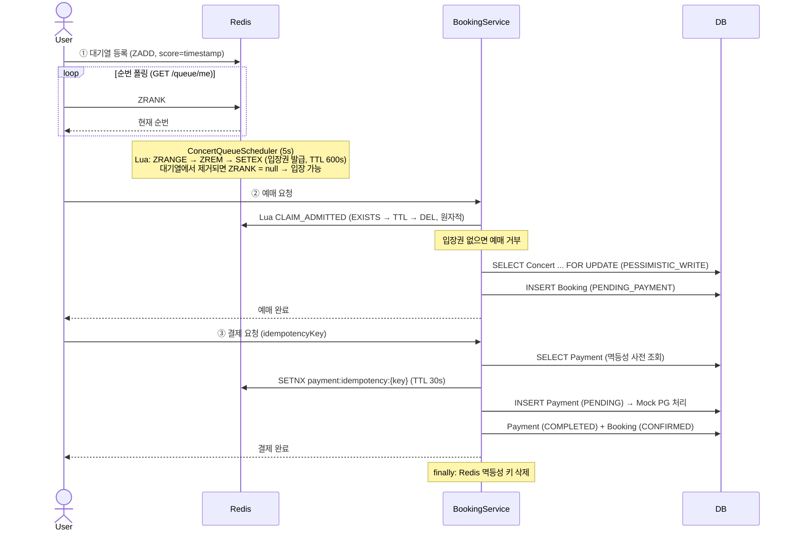
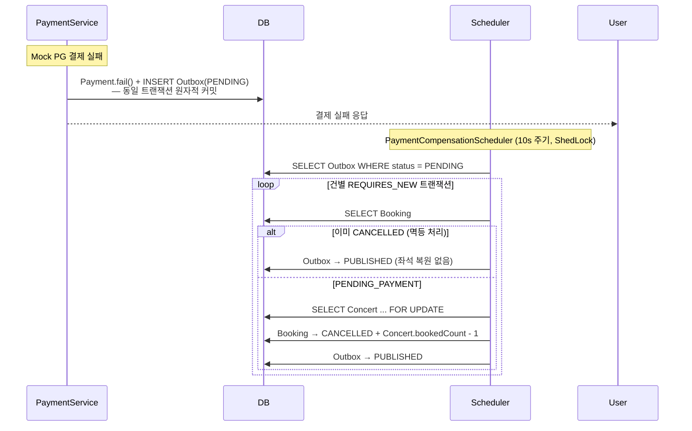
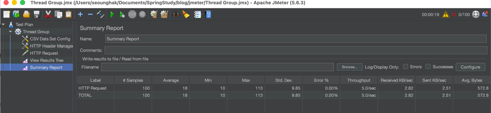

<div align="center">

# TicketFlow

**동시성 티켓팅 환경에서 초과 예매·중복 결제·보상 누락을 직접 재현하고, 각 문제를 독립적으로 해결한 백엔드 프로젝트입니다.**

</div>

---

## 🙋‍♂️ 프로젝트 소개

"동시에 100명이 좌석 1개에 몰리면 어떻게 될까?" 라는 질문에서 시작했습니다.

단순한 CRUD 구조에서는 아래 문제들이 발생합니다.

| 문제 | 원인 |
|---|---|
| **초과 예매** | 잔여석 확인과 INSERT 사이 타이밍 차이 |
| **중복 결제** | 네트워크 재시도 또는 동시 중복 요청 |
| **보상 누락** | 결제 실패 후 좌석 복구 로직 유실 |
| **방치 예약** | 미결제 예약의 좌석 장기 점유 |

각 문제를 `experiments/` 패키지에서 전략별로 직접 실험해 한계를 확인했고, 그 결과를 실제 구현에 반영했습니다.

- Redis Sorted Set + Lua Script — 선착순 입장 순서를 원자적으로 제어
- `SELECT ... FOR UPDATE` — 최종 좌석 차감 구간의 동시성 충돌 방지
- DB 사전 조회 → Redis SETNX → DB unique key — 3계층 멱등성으로 중복 결제 차단
- Transactional Outbox — 결제 실패와 보상 이벤트를 같은 트랜잭션에 묶어 유실 방지

---

## 📂 프로젝트 구조

```text
ticketflow/
├── backend/
│   ├── config/        # JWT, OAuth2, Security, ShedLock
│   ├── controller/    # Booking, Payment, Concert, Queue API
│   ├── domain/        # Concert, Booking, Payment, Outbox 핵심 엔티티
│   ├── dto/           # 요청/응답 DTO
│   ├── repository/    # JPA Repository (Pessimistic Lock 쿼리 포함)
│   ├── scheduler/     # QueueScheduler / ExpiryScheduler / CompensationScheduler
│   ├── service/       # 예매, 결제, 대기열, 쿠폰 비즈니스 로직
│   └── experiments/   # 전략 비교 실험 코드 (e1 쿠폰 / e3 멱등성 / e4 보상)
└── frontend/          # React + Vite UI
```

---

## 🛠️ 기술 스택

### Backend


### Data


-4B4B4B?style=for-the-badge&logoColor=white)

### Frontend


### Infra / Monitoring / Testing


---

## ⚡️ 주요 기능

- **Redis 대기열** — Sorted Set으로 선착순 입장 제어, Scheduler가 Lua 스크립트로 상위 50명에게 원자적으로 입장권 발급
- **비관적 락 예매** — 입장권 소비 + `SELECT ... FOR UPDATE`로 좌석 수 정합성 보호
- **3계층 멱등성** — DB 사전 조회 → Redis SETNX → DB unique key 계층적 중복 결제 차단
- **Transactional Outbox** — 결제 실패와 보상 이벤트를 같은 트랜잭션에 저장, Scheduler 재처리 (최대 3회)
- **입장권 복원** — 예매 중 DB 처리 실패 시 입장권을 원래 TTL로 복원해 재시도 허용
- **자동 만료** — 30분 방치된 `PENDING_PAYMENT` 예약 자동 취소 및 좌석 복원
- **보안 2-chain** — `/api/**` JWT STATELESS + `/**` OAuth2/Google 세션 이중 구조
- **Toss API Circuit Breaker** — 외부 결제 API 장애 시 fallback 처리 및 타임아웃 분리
- **ShedLock** — 다중 인스턴스 환경에서 Scheduler 중복 실행 방지

---

## 🔄 시스템 아키텍처 및 플로우

### 서비스 구조

> (작성 예정)

### 예매 플로우



### 결제 실패 보상 플로우



---

## 💡 기술적 의사결정

`experiments/` 패키지에서 전략을 비교 실험하고, 각 전략의 한계를 확인한 뒤 실제 구현에 적용했습니다.

<details>
<summary><strong>Redis Sorted Set + Lua Script — 대기열과 원자성</strong></summary>

### 선택 이유

- **Sorted Set** — score를 요청 timestamp로 설정하면 선착순 대기열이 됩니다. `ZRANK` 한 번으로 현재 순번을 O(log N)에 조회할 수 있습니다.
- **Lua Script** — 대기열 pop과 입장권 발급은 `ZRANGE → ZREM → SETEX` 세 단계입니다. 중간에 끊기면 입장권이 중복 발급되거나 누락됩니다. Lua Script로 묶어 원자성을 보장했습니다.

```lua
-- POP_AND_GRANT: 대기열 상위 N명을 꺼내 입장권 발급
local users = redis.call('ZRANGE', queueKey, 0, count - 1)
if (#users == 0) then return users end
redis.call('ZREM', queueKey, unpack(users))
for i = 1, #users do
  redis.call('SETEX', admittedPrefix .. users[i], ttl, '1')
end
return users
```

입장권 소비도 같은 이유로 Lua Script를 사용합니다. EXISTS와 DEL 사이에 TTL이 만료되는 TOCTOU를 방지합니다.

```lua
-- CLAIM_ADMITTED: 입장권 확인 + 원자적 소비
if redis.call('EXISTS', key) == 0 then return -1 end
local ttl = redis.call('TTL', key)
redis.call('DEL', key)
return ttl
```

</details>

<details>
<summary><strong>Pessimistic Lock — Optimistic Lock 대신 비관적 락을 선택한 이유</strong></summary>

### 선택 이유

Optimistic Lock은 충돌 시 재시도를 요구합니다. 티켓팅처럼 충돌 빈도가 높은 환경에서는 재시도가 연속 실패하며 응답 지연과 불필요한 트랜잭션이 누적됩니다.

잔여석 감소 구간은 충돌이 빈번하고 락 유지 시간이 짧습니다. 이 구간에서는 재시도 없이 직렬화 처리가 가능한 Pessimistic Lock이 더 적합했습니다.

```
Optimistic:  충돌 → 재시도 → 재시도 → ... (고동시성에서 실패 누적)
Pessimistic: 락 대기 → 처리 → 릴리즈  (재시도 없음, 정합성 보장)
```

`EnrollConcurrencyTest` — 10스레드 동시 예매 시 정확히 1건만 성공함을 검증했습니다.

</details>

<details>
<summary><strong>3계층 멱등성 — 단일 전략의 한계에서 조합으로</strong></summary>

### 배경

`experiments/e3`에서 세 가지 멱등성 전략을 각각 실험했습니다.

| 전략 | 방식 | 한계 |
|---|---|---|
| A | DB PK INSERT (예외로 중복 감지) | 이미 처리된 요청을 미리 걸러내지 못함 |
| B | SELECT EXISTS → INSERT | SELECT-INSERT 사이 TOCTOU 가능 |
| C | Redis SETNX only | Redis 장애 시 방어선 소멸 |

### 설계

각 전략이 서로 다른 상황에서 한계를 가진다는 걸 확인한 뒤, 실제 구현에서는 세 계층을 조합했습니다.

| 계층 | 역할 | 대응 상황 |
|---|---|---|
| DB 사전 조회 | 이미 처리된 재시도 즉시 차단 | 정상 재시도 |
| Redis SETNX (TTL 30s) | 동시 진입 중복 요청 차단 | 동시 중복 클릭 |
| DB unique key | Redis 장애 시 최후 방어선 | Redis 장애 |

</details>

<details>
<summary><strong>Transactional Outbox — Fire-and-forget 대신 Outbox를 선택한 이유</strong></summary>

### 배경

`experiments/e4`에서 두 보상 전략을 비교 실험했습니다.

- **전략 A (Fire-and-forget)** — 결제 실패 시 즉시 보상 호출. N번째마다 실패를 주입하자 보상 자체가 유실됨
- **전략 B (Outbox)** — 결제 실패와 Outbox를 같은 트랜잭션에 저장. 동일 실패율을 주입해도 스케줄러 재처리로 최종 100% 보상 성공 확인

### 선택 이유

```
Fire-and-forget: 결제 실패 → 보상 호출 → 앱 종료/예외 → 이벤트 유실

Outbox 패턴:    결제 실패 → Payment.fail()
                           + INSERT Outbox  ← 동일 트랜잭션
               앱 재시작 후에도 Outbox가 남아 Scheduler가 재처리
```

실패 기록과 보상 이벤트가 같은 트랜잭션에 저장되므로, 실패가 남아있다면 보상 대상도 반드시 남습니다.

각 Outbox는 `REQUIRES_NEW` 트랜잭션으로 독립 처리되며, 최대 3회 재시도 후 `FAILED`로 전환되어 Grafana 알림을 발송합니다.

</details>

<details>
<summary><strong>Circuit Breaker + Timeout — 외부 결제 API 장애 대응</strong></summary>

외부 PG(Toss API) 호출이 지연되면 스레드가 블로킹된 채로 연쇄 장애로 이어질 수 있습니다.

- **타임아웃 분리** — API 호출 타임아웃을 별도로 설정해 스레드 점유 시간 제한
- **Circuit Breaker** — 연속 실패 임계치 초과 시 회로 오픈, fallback 처리로 서비스 보호
- **Outbox 연계** — 회로 오픈 상태의 실패도 Outbox에 기록되어 보상 처리

</details>

---

## 📈 부하 테스트 및 성능

동시 사용자 **100명**으로 예매 → 결제 전체 플로우를 부하 테스트했습니다.
로컬 환경이므로 절대적인 응답 시간보다, 동시 요청 상황에서도 데이터 정합성이 깨지지 않는 것을 핵심 지표로 삼았습니다.

<details>
<summary><strong>부하 테스트 상세 보기</strong></summary>

### 핵심 결과 요약

| 지표 | 결과 |
|---|---|
| 동시 사용자 | **100명** |
| 평균 응답 시간 | **18~21ms** |
| 에러율 | **0%** |
| 초과 예매 | **0건** |
| 중복 결제 | **0건** |

---

<details>
<summary><strong>JMeter — 성능 측정</strong></summary>



*100건 동시 요청 기준. 평균 18ms, 에러율 0%, 처리량 5.0 req/sec.*

Pessimistic Lock과 Redis SETNX 기반 멱등성 제어가 동시 트래픽 하에서도 정상 작동했습니다.

| 항목 | 값 |
|---|---|
| 도구 | Apache JMeter 5.6.3 |
| 대상 API | 예매 API, 결제 API |
| 평균 / 최소 / 최대 | 18ms / 10ms / 113ms |
| 처리량 | 5.0 req/sec |
| 실행 환경 | Docker Compose (로컬) |

</details>

<details>
<summary><strong>Grafana — 정합성 모니터링</strong></summary>


*예매 성공률 100%, 결제 성공률 100%. 결과 분포 기준으로 정합성 검증.*

예매/결제 결과 분포에서 `ALREADY_BOOKED`와 `MOCK/CACHED`가 기록되었습니다.
이는 중복 요청이 실제로 발생했음에도 시스템이 정상적으로 차단했다는 직접적인 근거입니다.

| 분포 항목 | 의미 |
|---|---|
| `BOOKED` | 예매 성공 |
| `ALREADY_BOOKED` | 중복 예매 시도 → 차단됨 |
| `SOLD_OUT` | 잔여석 없음 |
| `MOCK/COMPLETED` | 결제 성공 |
| `MOCK/CACHED` | 멱등성 키로 재반환 (중복 결제 차단) |

</details>

</details>

---

## 💾 DB 성능 튜닝

<details>
<summary><strong>DB 인덱스 최적화 — (status, created_at) 복합 인덱스 적용</strong></summary>

### 배경

`BookingExpiryScheduler`는 60초 주기로 아래 쿼리를 실행합니다.

```sql
SELECT * FROM booking
WHERE status = 'PENDING_PAYMENT'
  AND created_at < NOW() - INTERVAL 30 MINUTE
ORDER BY created_at ASC
LIMIT 1000;
```

10만 건 데이터 환경에서 `EXPLAIN`을 실행하자 인덱스 없이 Full Table Scan이 발생했습니다.

**Before — EXPLAIN**


`type=ALL`, `key=NULL` — 10만 건 전체를 읽은 뒤 조건 필터링을 수행합니다.

**Before — 실행 시간 (5회 평균)**


평균 **45~50ms** 수준이며, 데이터가 누적될수록 비용이 선형으로 증가합니다.

---

### 인덱스 적용

```sql
CREATE INDEX idx_booking_status_created_at ON booking(status, created_at);
```

`status` 조건으로 스캔 대상을 먼저 좁힌 뒤 `created_at` 범위를 순서대로 읽습니다.

**After — EXPLAIN**


`type=range`, `key=idx_booking_test_status_created_at`, `Using index condition` — Index Range Scan으로 전환됩니다.

**After — 실행 시간 (5회 평균)**


평균 **1.7~2.2ms** 수준으로 개선됩니다.

---

### 결과 요약

| 항목 | Before | After |
|---|---|---|
| 실행 계획 | `type=ALL` (Full Table Scan) | `type=range` (Index Range Scan) |
| 사용 인덱스 | `NULL` | `idx_booking_status_created_at` |
| 평균 실행 시간 | ~45ms | ~2ms |

> 만료 조회 쿼리(`created_at < X`)는 조건 범위가 넓어 인덱스 후에도 읽는 데이터가 많습니다.  
> 양쪽 범위로 제한된 쿼리에서는 약 22배 개선도 확인했습니다.

</details>

---

## 🚨 트러블슈팅

<details>
<summary><strong>Outbox 상태가 처리 후에도 PENDING으로 남았다</strong></summary>

### 문제

보상 처리 로직이 실행된 뒤에도 `PaymentCompensationOutbox` 상태가 `PUBLISHED`나 `FAILED`로 바뀌지 않고 계속 `PENDING`으로 남아, 동일한 Outbox가 스케줄러에 의해 반복 조회됐습니다.
처리 상태 추적 자체가 깨지는 상황이었기 때문에 단순 상태값 문제 이상이었습니다.

### 원인

스케줄러 메서드에는 별도 트랜잭션이 없었습니다. `findByStatus()` 호출은 Spring Data JPA가 내부적으로 짧은 트랜잭션을 열고 바로 닫습니다. 이 시점에 반환된 엔티티는 **detached 상태**가 됩니다.

이 detached 엔티티를 `REQUIRES_NEW` 트랜잭션의 Processor로 그대로 넘기면, 새 영속성 컨텍스트는 해당 엔티티를 관리하지 않습니다. `outbox.markPublished()`를 호출해도 자바 객체의 필드값만 바뀔 뿐, dirty checking이 동작하지 않아 DB UPDATE가 일어나지 않았습니다.

### 해결

Processor의 메서드 시그니처를 `process(outbox)` → `process(outboxId)`로 변경했습니다.
`REQUIRES_NEW` 트랜잭션 내부에서 `findById(outboxId)`로 엔티티를 다시 조회해, **현재 트랜잭션이 관리하는 managed 엔티티** 기준으로 상태를 변경하도록 수정했습니다.

```java
// Before: detached 엔티티를 그대로 전달
outboxProcessor.process(outbox);

// After: ID만 전달 → REQUIRES_NEW 트랜잭션 내부에서 재조회
outboxProcessor.process(outbox.getId());
```

### 결과

수정 후 Outbox 상태가 정상적으로 `PUBLISHED`/`FAILED`로 반영됐습니다.
JPA에서 `@Transactional`을 붙이는 것만큼이나, **어떤 트랜잭션에서 로드된 엔티티인지**가 중요하다는 점을 확인했습니다.

</details>

<details>
<summary><strong>특정 Outbox 실패가 다른 Outbox 처리에 영향을 줬다</strong></summary>

### 문제

초기 `PaymentCompensationScheduler`는 PENDING Outbox 여러 건을 한 트랜잭션 안에서 순차 처리했습니다. 특정 Outbox 처리 중 예외가 발생하더라도 앞에서 변경된 Booking/Concert 상태가 다른 Outbox 처리와 함께 커밋될 수 있었습니다. 보상 처리 상태와 실제 데이터 상태가 어긋날 가능성이 있었습니다.

### 원인

Outbox 패턴은 이벤트 단위로 처리 성공/실패가 명확해야 하는데, 여러 이벤트를 하나의 트랜잭션으로 묶으면 일부 실패가 다른 이벤트에 영향을 줍니다.

같은 클래스 안의 메서드에 `@Transactional(REQUIRES_NEW)`를 붙이는 방식도 생각했지만, Spring AOP는 self-invocation을 프록시로 감싸지 않으므로 실제로는 새 트랜잭션이 열리지 않습니다.

### 해결

보상 처리 로직을 `PaymentCompensationOutboxProcessor`라는 별도 Bean으로 분리했습니다.
스케줄러에서 트랜잭션을 제거하고, `process()`와 `markRetry()` 각각에 `@Transactional(propagation = REQUIRES_NEW)`를 적용해 Outbox 한 건마다 독립된 트랜잭션이 열리도록 만들었습니다.

```java
// PaymentCompensationOutboxProcessor
@Transactional(propagation = Propagation.REQUIRES_NEW)
public void process(Long outboxId) { ... }

@Transactional(propagation = Propagation.REQUIRES_NEW)
public void markRetry(Long outboxId, Exception cause) { ... }
```

### 결과

Outbox A 실패가 Outbox B 처리에 영향을 주지 않게 됐습니다.
Outbox 패턴은 테이블을 두는 것만이 아니라, **트랜잭션 경계를 어떻게 자르느냐**가 핵심이라는 점을 확인했습니다.

</details>

<details>
<summary><strong>Toss API 실패 시 보상 이벤트가 생성되지 않았다</strong></summary>

### 문제

Mock 결제 실패 경로에서는 보상용 Outbox가 생성됐지만, 실제 Toss 승인 API 호출 중 예외가 발생하는 경로에서는 Outbox가 생성되지 않을 수 있었습니다.
결제는 실패했지만 보상 이벤트가 남지 않아, 스케줄러가 복구할 대상을 알 수 없는 상태였습니다.

### 원인

"결제 실패"라는 동일한 도메인 사건을 경로에 따라 다르게 처리하고 있었습니다.

- Mock 실패 경로: `payment.fail()` + Outbox 저장
- Toss API 예외 경로: 예외 발생 후 종료, 보상 이벤트 없음

### 해결

Toss API 호출 실패도 Mock 실패와 동일하게 `payment.fail()` + Outbox 저장이 **동일 트랜잭션으로 원자적으로 커밋**되도록 맞췄습니다.

```java
try {
    paymentMethod = tossPaymentClient.confirm(...);
} catch (Exception e) {
    payment.fail("Toss API 실패: " + e.getMessage());
    outboxRepository.save(PaymentCompensationOutbox.create(payload)); // 동일 트랜잭션
    return PaymentResponse.from(payment);
}
```

### 결과

외부 PG 호출 실패가 발생해도 보상 처리 경로가 끊기지 않습니다.
외부 API 연동에서는 성공보다도 **"실패 시 어떤 흔적을 남기고 복구 흐름을 이어갈 것인가"** 가 더 중요하다는 점을 확인했습니다.

</details>

<details>
<summary><strong>동시성 테스트에서 초과 예매가 발생했다</strong></summary>

### 문제

10스레드로 동시에 예매 요청을 보내자 잔여석이 1개인 콘서트에서 2건 이상 예매가 성공했습니다.

### 원인

`findById`로 잔여석을 조회한 뒤 INSERT하는 구조였습니다. 두 트랜잭션이 동시에 같은 잔여석 값을 읽고 둘 다 "예매 가능"으로 판단했습니다.

```
Thread A: SELECT remainingSeats = 1 → 예매 가능 → INSERT
Thread B: SELECT remainingSeats = 1 → 예매 가능 → INSERT  ← 초과 예매
```

대기열은 진입 순서를 제어할 뿐, DB에서 좌석을 차감하는 마지막 순간의 경쟁은 막지 못합니다. 초과 예매는 대기열 문제가 아니라 **최종 재고 차감 구간의 정합성 문제**였습니다.

### 해결

`findByIdForUpdate`로 `SELECT ... FOR UPDATE`(Pessimistic Write)를 적용했습니다. Redis는 진입 제어, DB 락은 최종 정합성 보장으로 책임을 나눴습니다.

```java
@Lock(LockModeType.PESSIMISTIC_WRITE)
@Query("SELECT c FROM Concert c WHERE c.id = :id")
Optional<Concert> findByIdForUpdate(@Param("id") Long id);
```

### 결과

`EnrollConcurrencyTest` — 10스레드 동시 예매 시 정확히 1건만 성공.
JMeter 100명 부하 테스트에서도 초과 예매 0건을 확인했습니다.

</details>

<details>
<summary><strong>결제가 중복 처리됐다</strong></summary>

### 문제

버튼 중복 클릭이나 네트워크 오류 후 재시도 상황에서 동일한 결제가 두 번 처리됐습니다.

### 원인

처음에는 DB unique key 하나로 중복 결제를 막을 수 있다고 판단했습니다. 하지만 두 요청이 거의 동시에 들어오면 둘 다 비즈니스 로직 초반을 통과할 수 있고, DB INSERT 시점에야 충돌이 드러나며 불필요한 DB 경합이 발생했습니다.

또한 이미 성공한 결제를 사용자가 정상적으로 재시도하는 경우에는 예외 처리보다 기존 결과를 재반환하는 것이 더 적합했습니다. "정상 재시도"와 "동시 중복 요청"을 하나의 방어선으로 처리하려 했던 것이 문제였습니다.

### 해결

멱등성 처리를 3계층으로 나눴습니다.

| 계층 | 역할 | 대응 상황 |
|---|---|---|
| DB 사전 조회 | 이미 처리된 요청이면 기존 결과 즉시 반환 | 정상 재시도 |
| Redis SETNX (TTL 30s) | 동일 키의 동시 요청을 앞단에서 차단 | 동시 중복 클릭 |
| DB unique key | Redis 장애 시 최후 방어선 | Redis 장애 |

### 결과

`PaymentServiceFailRateTest` — 동일 idempotencyKey로 재요청 시 기존 결과가 반환됨을 검증했습니다.
멱등성은 unique key 하나를 두는 것이 아니라, **재시도 경험과 동시성 충돌을 분리해서 설계**해야 한다는 점을 확인했습니다.

</details>

<details>
<summary><strong>입장권이 중복 발급됐다</strong></summary>

### 문제

초기 구현에서 입장권 소비를 Java에서 `EXISTS` 확인 후 `DEL`로 처리했습니다. EXISTS와 DEL 사이에 TTL이 만료되면 DEL이 성공해도 이미 만료된 키를 삭제한 것이므로, 입장권이 없는 상태에서 예매가 진행됐습니다.

```
EXISTS → true
  ... TTL 만료 ...
DEL → 성공 (없는 키라도 에러 없음)
→ 예매 진행  ← 의도치 않은 통과
```

대기열 pop + 입장권 발급 흐름(`ZRANGE → ZREM → SETEX`)도 마찬가지였습니다. 명령 사이에 다른 스케줄러 실행이 끼어들면 입장권이 중복 발급될 수 있었습니다.

### 해결

핵심 Redis 연산을 Lua Script로 묶어 원자성을 보장했습니다.

```lua
-- POP_AND_GRANT: 상위 N명 조회 → 대기열 제거 → 입장권 발급 (원자적)
local users = redis.call('ZRANGE', queueKey, 0, count - 1)
if (#users == 0) then return users end
redis.call('ZREM', queueKey, unpack(users))
for i = 1, #users do
  redis.call('SETEX', admittedPrefix .. users[i], ttl, '1')
end
return users

-- CLAIM_ADMITTED: EXISTS → TTL → DEL (원자적), 없으면 -1 반환
if redis.call('EXISTS', key) == 0 then return -1 end
local ttl = redis.call('TTL', key)
redis.call('DEL', key)
return ttl
```

반환된 TTL을 활용해, DB 처리 실패 시 입장권을 원래 잔여 TTL로 복원해 재시도를 허용합니다.

### 결과

입장권이 없거나 만료된 상태에서 예매를 시도하면 정확하게 차단됩니다.
Redis는 빠른 캐시 이상의 의미가 있으며, **고동시성 구간에서는 원자적 연산 단위를 직접 설계하는 것이 중요**하다는 점을 배웠습니다.

</details>

<details>
<summary><strong>Toss API 장애가 내부 서비스로 전파됐다</strong></summary>

### 문제

외부 PG API 호출이 지연되거나 실패하면 결제 서비스 전체가 영향을 받았습니다. 초기 구조에서는 `PaymentService` 내부에서 직접 Toss API를 호출했고, 응답 지연이 길어질 경우 요청 스레드가 장시간 점유돼 서비스 전체 응답성이 나빠질 수 있었습니다.

### 원인

비즈니스 로직과 외부 API 호출이 한 클래스에 섞여 있었고, 외부 API 장애를 빠르게 차단할 장치가 없었습니다. 외부 시스템 장애가 내 서비스 내부까지 그대로 전파되는 구조였습니다.

### 해결

외부 API 호출을 `TossPaymentClient`로 분리하고 Circuit Breaker와 timeout을 적용했습니다.

- `PaymentService`는 결제 흐름만 담당
- `TossPaymentClient`는 Toss 승인 호출만 담당
- Circuit Breaker로 연속 실패 시 빠르게 호출 차단
- connect/read timeout 3초 설정으로 장시간 대기 방지

별도 fallback 메서드는 두지 않았습니다. Circuit Breaker나 timeout 예외도 기존 `catch` 블록의 `payment.fail()` + Outbox 저장 경로로 합류하도록 설계해, **장애 보호 로직을 추가하면서도 기존 보상 흐름을 그대로 유지**했습니다.

### 결과

외부 PG 장애 시 느린 요청을 빠르게 차단하고, 연속 실패 시 Circuit Open으로 불필요한 호출을 줄일 수 있게 됐습니다.
외부 API 연동에서는 **장애를 내 서비스 안으로 얼마나 덜 가져오게 설계하느냐**가 기능 구현 자체보다 중요하다는 점을 배웠습니다.

</details>

---

## 참조 문서

- [`docs/architecture.md`](docs/architecture.md) — 패키지 구조, Redis 키 명세, Lua Script, Scheduler 상세
- [`docs/flow.md`](docs/flow.md) — 예매/보상/만료 시퀀스 다이어그램, 상태 전이
- [`docs/api.md`](docs/api.md) — 전체 REST 엔드포인트 목록
- [`docs/testing.md`](docs/testing.md) — 테스트 전략, 클래스별 설명, 실행 환경
