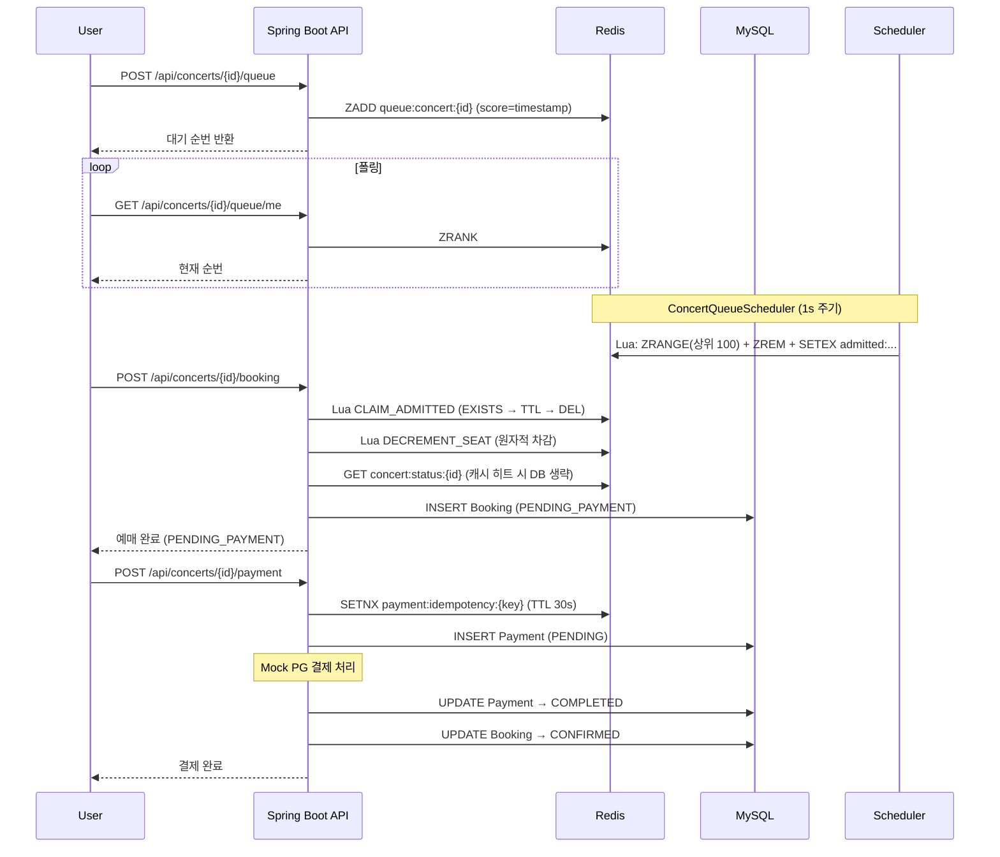
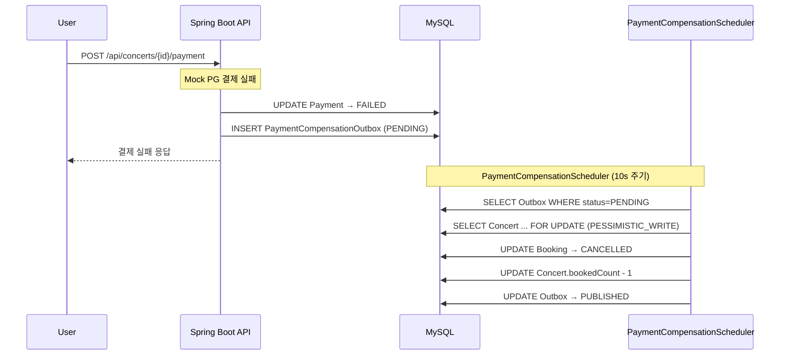
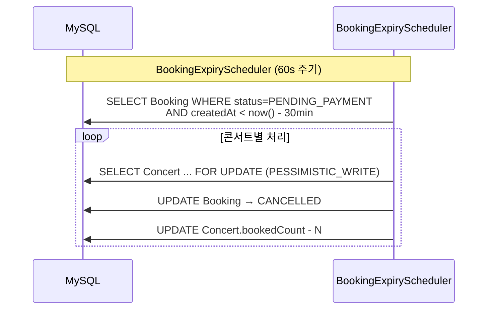

# 예매 플로우

## 정상 예매 시퀀스



---

## 결제 실패 보상 시퀀스



---

## PENDING_PAYMENT 만료 시퀀스



---

## 멱등성 처리 레이어

결제 요청이 중복으로 들어올 경우 아래 순서로 방어:

```
1. DB 조회: idempotencyKey 기존 Payment 존재 여부 확인
   → 존재하면 기존 결과 반환 (즉시 종료)

2. Redis SETNX: payment:idempotency:{key} (TTL 30s)
   → 동시 요청이 있으면 두 번째 요청은 락 획득 실패
   → "처리 중" 응답 반환

3. DB unique constraint: uk_payment_idempotency_key
   → 1, 2를 통과해도 DB에서 최종 방어
```

---

## BookingStatus 상태 전이

```
PENDING_PAYMENT
    │
    ├─[결제 성공]──────────→ CONFIRMED (최종)
    │
    ├─[결제 실패 보상]──────→ CANCELLED (최종)
    │
    └─[30분 방치]──────────→ CANCELLED (최종)
```
